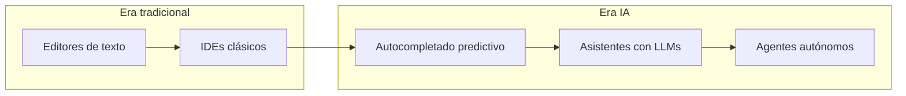
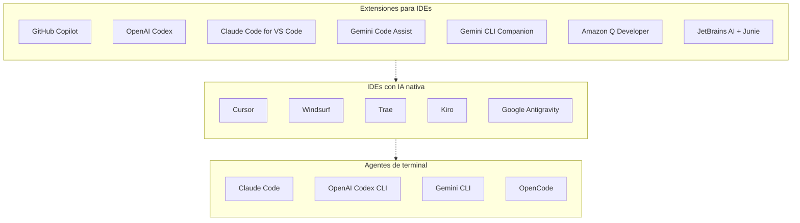
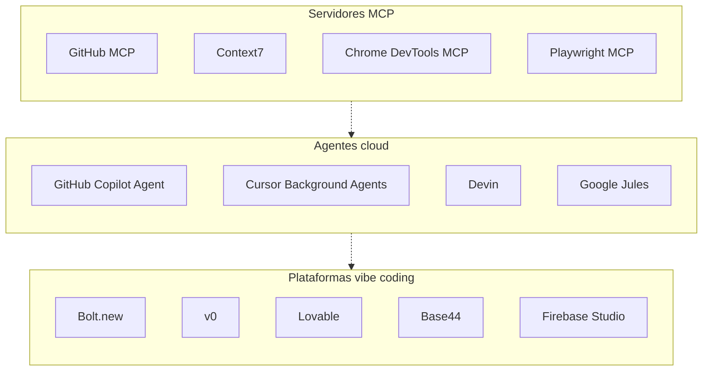
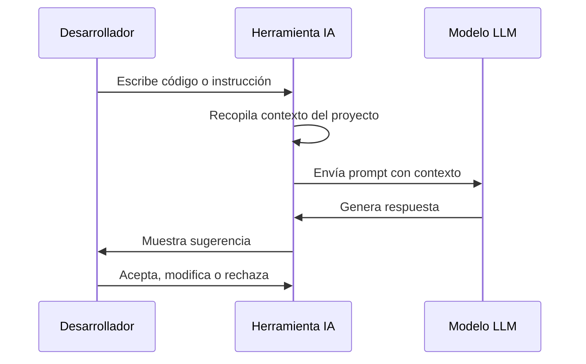

Autor: Alan Sastre

GitHub: [github.com/alansastre/genai-asistentes-codigo](https://github.com/alansastre/genai-asistentes-codigo)

El desarrollo de software ha experimentado una transformación profunda con la llegada de los **modelos de lenguaje de gran escala** (LLMs). Las herramientas tradicionales de programación han evolucionado para incorporar capacidades de inteligencia artificial que asisten a los desarrolladores en tareas como la generación de código, la depuración, la refactorización y la navegación por bases de código complejas. Según el informe DORA 2025 de Google, el **90% de los desarrolladores** ya utiliza IA en su trabajo diario, lo que refleja una adopción prácticamente universal de estas tecnologías.

## La evolución del desarrollo de software

Durante décadas, los desarrolladores han utilizado diferentes tipos de herramientas para escribir código. Los **editores de texto** simples como Vim o Emacs fueron las primeras opciones, ofreciendo funcionalidades básicas de edición. Posteriormente, los **entornos de desarrollo integrado** (IDE) como Visual Studio Code o los productos de JetBrains añadieron características como el autocompletado basado en sintaxis, la refactorización automática y la integración con sistemas de control de versiones.

La aparición de los primeros asistentes de código con IA introdujo el concepto de **autocompletado predictivo** basado en aprendizaje automático. Sin embargo, fue la llegada de los grandes modelos de lenguaje lo que marcó un verdadero punto de inflexión. Estos modelos, entrenados con enormes cantidades de código y documentación, son capaces de comprender el contexto de un proyecto y generar código coherente y funcional.

> Las herramientas de IA para desarrollo no reemplazan al programador, sino que actúan como un **copiloto** que acelera las tareas repetitivas y permite dedicar más tiempo a la resolución de problemas complejos y la toma de decisiones arquitectónicas.

Este diagrama ilustra la **progresión histórica** desde los editores básicos hasta los agentes autónomos actuales. Cada etapa ha construido sobre la anterior, añadiendo capas de inteligencia que permiten una interacción más natural entre el desarrollador y sus herramientas.

## Taxonomía de herramientas de IA para desarrollo

El ecosistema actual de herramientas de IA para desarrollo se puede clasificar en **seis categorías principales**, cada una con características y casos de uso específicos. Esta taxonomía permite entender las opciones disponibles y seleccionar la herramienta más adecuada según las necesidades del proyecto.

### Extensiones para IDEs existentes

Las **extensiones** se instalan sobre editores e IDEs ya existentes, principalmente Visual Studio Code y los productos de JetBrains. Estas herramientas añaden capacidades de IA sin cambiar el entorno de trabajo habitual del desarrollador, lo que facilita su adopción en equipos que ya tienen flujos de trabajo establecidos.

Las extensiones más relevantes provienen de los principales proveedores de modelos de lenguaje:

* **GitHub Copilot** es la extensión más extendida, desarrollada por GitHub en colaboración con OpenAI. Ofrece sugerencias de código en tiempo real, chat contextual mediante **GitHub Copilot Chat**, y en sus versiones empresariales, escaneo de vulnerabilidades de seguridad.

* **OpenAI Codex** es la extensión oficial de OpenAI para Visual Studio Code, proporcionando acceso directo a los modelos de OpenAI con capacidades de generación de código y asistencia conversacional.

* **Claude Code for VS Code** es la extensión de Anthropic que integra Claude directamente en Visual Studio Code, ofreciendo las capacidades de razonamiento y comprensión de código características de los modelos Claude.

* **Google Gemini Code Assist** proporciona acceso a los modelos Gemini de Google dentro del editor, con funcionalidades de autocompletado, explicación de código y generación a partir de prompts.

* **Amazon Q Developer** es la extensión de AWS que ofrece autocompletado, chat, análisis de seguridad y soporte nativo para servicios cloud de AWS. Incluye capacidades agénticas para tareas complejas y soporte para MCP, permitiendo integrar herramientas externas en el flujo de trabajo.

* **JetBrains AI Assistant** está integrado nativamente en los IDEs de JetBrains (IntelliJ IDEA, PyCharm, WebStorm, etc.), aprovechando la integración profunda con las herramientas de refactorización y análisis de código propias de estos entornos. Incluye **Junie**, un agente de codificación ahora integrado directamente en el chat de IA, y **next edit suggestions**, una funcionalidad que sugiere modificaciones en el código más allá de la posición del cursor, combinando modelos de IA con acciones determinísticas del IDE.

> Las extensiones de los proveedores principales garantizan acceso a los modelos más recientes y suelen ofrecer mejor integración con sus respectivos ecosistemas de servicios.

### IDEs con IA nativa

Los **IDEs con IA integrada** representan una nueva generación de entornos de desarrollo diseñados desde cero para la era de la inteligencia artificial. A diferencia de las extensiones, estos IDEs tienen la IA como componente central de su arquitectura.

* **Cursor** está basado en Visual Studio Code e incorpora funcionalidades como autocompletado avanzado, chat contextual y un modo agente capaz de realizar cambios coordinados en múltiples archivos. Su arquitectura permite elegir entre diferentes modelos de lenguaje.

* **Windsurf** incluye un motor de comprensión de contexto que indexa el código base y su agente para tareas complejas que requieren múltiples pasos.

* **Trae**, desarrollado por ByteDance, es un IDE gratuito basado en Visual Studio Code. Ofrece modos de chat y de agente para asistir en el desarrollo, con soporte nativo para MCP que permite extender sus capacidades mediante servidores externos.

* **Kiro**, de AWS, introduce el concepto de **desarrollo guiado por especificaciones** (spec-driven development), donde las instrucciones del usuario se transforman en requisitos estructurados, documentos de diseño y listas de tareas antes de generar código. También incorpora **hooks** que automatizan tareas repetitivas como la generación de tests o la actualización de documentación.

* **Google Antigravity** adopta un enfoque **agent-first**, donde los agentes autónomos son el mecanismo principal de interacción, relegando la edición manual a un papel secundario.

> Los IDEs con IA nativa ofrecen una experiencia más fluida que las extensiones, ya que la IA tiene acceso directo a todas las funcionalidades del editor y puede optimizar la interacción con el código base completo.

### Agentes de terminal

Las **herramientas de línea de comandos** con IA permiten interactuar con modelos directamente desde la terminal. Son especialmente útiles para desarrolladores que prefieren flujos de trabajo basados en teclado o que trabajan en entornos sin interfaz gráfica.

* **Claude Code**, de Anthropic, destaca por su capacidad de operar directamente sobre el sistema de archivos, ejecutar comandos de shell y realizar cambios en el código de forma autónoma. Su ventana de contexto extendida permite comprender proyectos completos.

* **OpenAI Codex CLI** y **Gemini CLI** proporcionan acceso a sus respectivos modelos desde la terminal, facilitando tareas como la generación de scripts, la explicación de comandos complejos o la automatización de flujos de trabajo.

Estas herramientas suelen ofrecer diferentes **modos de aprobación** que permiten controlar cuánta autonomía tiene el agente: desde requerir confirmación para cada acción hasta permitir ejecución completamente autónoma.

### Agentes cloud

Los **agentes cloud** representan el nivel más avanzado de automatización. Estas herramientas trabajan de forma **asíncrona** en segundo plano, ejecutándose en infraestructura remota mientras el desarrollador se dedica a otras tareas.

* **GitHub Copilot Coding Agent** puede recibir un issue de GitHub y trabajar sobre el repositorio para implementar una solución, creando un pull request cuando termina.

* **Cursor Background Agents** permiten delegar tareas complejas que se ejecutan en la nube, liberando los recursos locales del desarrollador.

* **Google Jules** es el agente autónomo de Google, integrado con GitHub y ejecutándose en máquinas virtuales de Google Cloud. Puede escribir tests, corregir bugs, implementar nuevas funcionalidades y actualizar dependencias de forma independiente, presentando su plan de trabajo antes de ejecutar cambios.

* **Devin**, de Cognition Labs, es un ejemplo de agente completamente autónomo capaz de planificar, implementar, probar y depurar soluciones de forma independiente. Puede utilizar navegadores, terminales y editores como lo haría un desarrollador humano.

> Los agentes cloud cambian fundamentalmente el modelo de trabajo: en lugar de programar línea a línea, el desarrollador define objetivos y revisa resultados.

### Plataformas vibe coding

El término **vibe coding** se ha consolidado para describir el desarrollo de aplicaciones mediante descripciones en lenguaje natural desde el navegador. Estas plataformas permiten crear aplicaciones completas sin necesidad de configurar un entorno local, siendo especialmente útiles para prototipado rápido y para usuarios sin experiencia técnica profunda.

* **Bolt.new** permite generar aplicaciones full-stack completas a partir de descripciones en lenguaje natural, incluyendo frontend, backend y base de datos, todo ejecutándose en el navegador.

* **v0**, de Vercel, se especializa en la generación de interfaces de usuario y componentes React con Tailwind CSS a partir de prompts de texto, facilitando el diseño de frontends de forma conversacional.

* **Lovable** y **Base44** ofrecen capacidades similares, permitiendo describir una aplicación en lenguaje natural y obtener código funcional desplegable. Base44 integra nativamente componentes como bases de datos, autenticación y almacenamiento de archivos.

* **Firebase Studio** (anteriormente Project IDX) ofrece un entorno de desarrollo completo basado en VS Code que se ejecuta en la nube, combinando las capacidades de un IDE tradicional con asistencia de IA.

### Servidores MCP

El **Model Context Protocol** (MCP) es un estándar abierto que permite a los modelos de lenguaje conectarse con herramientas externas, APIs y fuentes de datos. Los servidores MCP actúan como puentes que exponen capacidades específicas a los agentes de IA, ampliando significativamente lo que pueden hacer.

El [GitHub MCP Registry](https://github.com/mcp) es el directorio centralizado de servidores MCP verificados, donde empresas como Microsoft, Google, GitHub y proyectos open-source publican sus integraciones. Este registro facilita el descubrimiento e instalación de MCPs directamente desde las herramientas de IA compatibles.

Entre los servidores MCP más populares del registro destacan:

- **GitHub MCP**: permite a los agentes de IA conectarse directamente con repositorios de GitHub para gestionar issues, pull requests, workflows de GitHub Actions y operaciones sobre el código mediante lenguaje natural
- **Context7**: proporciona acceso a documentación actualizada de librerías y frameworks, permitiendo que los agentes generen código basado en las versiones más recientes de las APIs
- **Chrome DevTools MCP**: expone las herramientas de desarrollo de Chrome al agente, permitiendo inspeccionar elementos, analizar rendimiento y depurar aplicaciones web
- **Playwright MCP**: permite a los agentes controlar navegadores para realizar tests end-to-end, scraping o automatización web utilizando árboles de accesibilidad

> Los MCPs transforman a los agentes de IA de herramientas de generación de código a asistentes capaces de interactuar con sistemas reales: ejecutar tests, consultar documentación actualizada, gestionar repositorios y depurar aplicaciones.

La mayoría de IDEs con IA nativa y agentes de terminal soportan MCP, permitiendo configurar qué servidores están disponibles para cada proyecto. Esto crea un ecosistema extensible donde la comunidad puede desarrollar nuevas integraciones sin depender de los proveedores de las herramientas.

## Cómo funcionan las herramientas de IA para código

Todas estas herramientas comparten un **flujo de trabajo similar** basado en modelos de lenguaje. El proceso comienza con la recopilación de contexto: el código actual, los archivos relacionados, la documentación del proyecto y las instrucciones del usuario. Este contexto se envía al modelo como un prompt estructurado.

El modelo procesa la información y genera una respuesta, que puede ser código, explicaciones o sugerencias de cambios. La herramienta presenta esta respuesta al desarrollador, quien decide si aceptarla, modificarla o rechazarla.

La **calidad del contexto** es fundamental para obtener buenos resultados. Las herramientas más avanzadas utilizan técnicas como:

- **Indexación semántica** del código base para encontrar archivos relevantes
- **Detección de dependencias** entre módulos y funciones
- **Integración con documentación** externa y APIs
- **Historial de conversación** para mantener coherencia en sesiones largas

> El desarrollador mantiene siempre el control final sobre el código. Las herramientas de IA sugieren, pero la responsabilidad de validar y aprobar los cambios recae en el profesional.
