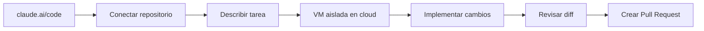

Autor: Alan Sastre

GitHub: [github.com/alansastre/genai-asistentes-codigo](https://github.com/alansastre/genai-asistentes-codigo)

Los **agentes cloud** representan un nivel más avanzado de automatización en el desarrollo de software. A diferencia de las extensiones, IDEs o CLIs que se ejecutan en el ordenador del desarrollador, estos agentes operan en **infraestructura remota**, trabajando de forma asíncrona mientras el desarrollador se dedica a otras tareas. Su integración con plataformas como GitHub permite delegar issues completos y recibir pull requests listos para revisión.

## Panorama de agentes cloud

| Agente | Tipo | Plataforma | Lanzamiento | Enlace |
|--------|------|------------|-------------|--------|
| Qodo (antes Codium) | Revisión | GitHub/GitLab | Mar 2023 | [Web oficial](https://www.qodo.ai/) |
| CodeRabbit | Revisión | GitHub/GitLab | Sep 2023 | [Web oficial](https://www.coderabbit.ai/) |
| Devin | Implementación | Cognition | Mar 2024 | [Web oficial](https://devin.ai/) |
| Claude Code en GitHub Actions | Implementación | GitHub | May 2025 | [Web oficial](https://code.claude.com/docs/en/github-actions) |
| GitHub Copilot Coding Agent | Implementación | GitHub | May 2025 | [Web oficial](https://docs.github.com/en/copilot) |
| Cursor Cloud Agents | Implementación | Cursor | Jun 2025 | [Web oficial](https://cursor.com/docs/cloud-agent) |
| Cursor Bugbot | Revisión | Cursor | Jun 2025 | [Web oficial](https://cursor.com/docs/bugbot) |
| Google Jules | Implementación | Google | Ago 2025 | [Web oficial](https://jules.google/) |
| Claude Code Web | Implementación | Anthropic | Oct 2025 | [Web oficial](https://claude.ai/code) |

### Qodo (Marzo 2023)

[Web oficial](https://www.qodo.ai/)

**Qodo** (anteriormente CodiumAI) se posiciona como la **capa de calidad** entre el código generado por IA y producción. Su diferenciador es el **Context Engine**: motor de indexación multi-repositorio que proporciona comprensión compartida del código base.

Ofrece revisión en IDE antes de crear el PR, integración con GitHub/GitLab/Bitbucket/Azure DevOps, y validación de compliance y políticas de seguridad.

### CodeRabbit (Septiembre 2023)

[Web oficial](https://www.coderabbit.ai/)

**CodeRabbit** se posicionó como pionero en la revisión de código automatizada con IA. Su diferenciador es el **sistema de learnings**: aprende del feedback del equipo para mejorar las revisiones y adaptarse al estilo del proyecto.

Soporta GitHub, GitLab, Bitbucket y Azure DevOps. Ofrece análisis contextual mediante AST (Abstract Syntax Tree) e integración con linters y scanners de seguridad.

### Devin (Marzo 2024)

[Web oficial](https://devin.ai/)

**Devin**, desarrollado por Cognition Labs, fue el primer producto en posicionarse como **ingeniero de software autónomo**. Su diferenciador es la capacidad de gestionar proyectos completos de forma independiente: planificación, codificación, depuración y despliegue.

Devin analiza el código base, presenta un **plan detallado** para aprobación y ejecuta múltiples instancias en paralelo. Ofrece integración con Slack para comunicación bidireccional.

### Claude Code en GitHub Actions (Mayo 2025)

[Web oficial](https://code.claude.com/docs/en/github-actions)

**Claude Code** permite ejecutar Claude Code directamente en repositorios de GitHub mediante GitHub Actions. Con una mención `@claude` en cualquier issue o pull request, Claude analiza el código, implementa cambios y crea PRs.

```yaml
name: Claude Code
on:
  issue_comment:
    types: [created]
  pull_request_review_comment:
    types: [created]
jobs:
  claude:
    runs-on: ubuntu-latest
    steps:
      - uses: anthropics/claude-code-action@v1
        with:
          anthropic_api_key: ${{ secrets.ANTHROPIC_API_KEY }}
```

Su diferenciador es la **configuración mediante CLAUDE.md**, donde se definen guías y estándares que el agente respeta automáticamente.

### GitHub Copilot Coding Agent (Mayo 2025)

[Web oficial](https://docs.github.com/en/copilot)

**GitHub Copilot Coding Agent** está integrado nativamente con GitHub. Su diferenciador es la **experiencia sin fricción**: asignar un issue al agente desde cualquier página de GitHub sin configuración adicional.

El flujo consiste en asignar un issue, Copilot analiza el código base, planifica los cambios, los implementa y crea un draft pull request solicitando revisión.

### Cursor Bugbot (Junio 2025)

[Web oficial](https://cursor.com/docs/bugbot)

**Cursor Bugbot** analiza automáticamente los pull requests en repositorios de GitHub. Su diferenciador es la **integración con Cursor**: forma parte del ecosistema del editor, compartiendo contexto y configuración.

Se activa automáticamente con cada actualización del PR o manualmente mediante comandos en comentarios. Proporciona sugerencias de corrección con código listo para aplicar.

> Los agentes de revisión complementan a los agentes de implementación: uno genera el código, el otro lo revisa, creando un ciclo de calidad automatizado.

### Cursor Cloud Agents (Junio 2025)

[Web oficial](https://cursor.com/docs/cloud-agent)

**Cursor Background Agent** permite delegar tareas desde el editor Cursor o mediante Slack. Su diferenciador es la **gestión visual**: un panel para monitorizar múltiples agentes trabajando en paralelo, enviar mensajes de seguimiento o tomar el control manualmente.

Los agentes operan en VMs aisladas, permitiendo ejecución paralela de múltiples tareas simultáneas.

### Google Jules (Agosto 2025)

[Web oficial](https://jules.google/)

**Google Jules** es el agente autónomo de Google, integrado con GitHub y ejecutándose en Google Cloud. Su diferenciador es la **privacidad**: no entrena con código privado y los datos permanecen aislados en el entorno de ejecución.

Ofrece CLI para integración en flujos existentes y API pública para automatización con sistemas de CI.

### Claude Code Web (Octubre 2025)

[Web oficial](https://claude.ai/code)

**Claude Code on the web** permite ejecutar tareas de Claude Code desde el navegador, sin necesidad de IDE ni terminal. Su diferenciador es la **accesibilidad**: conectar repositorios de GitHub y delegar tareas directamente desde claude.ai/code.



Incluye **teleport** para transferir sesiones web al terminal local y continuar trabajando desde CLI.


