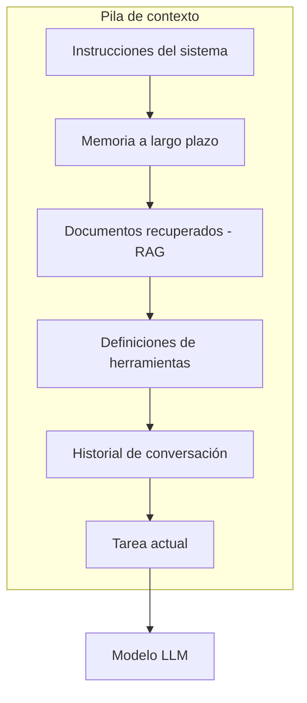
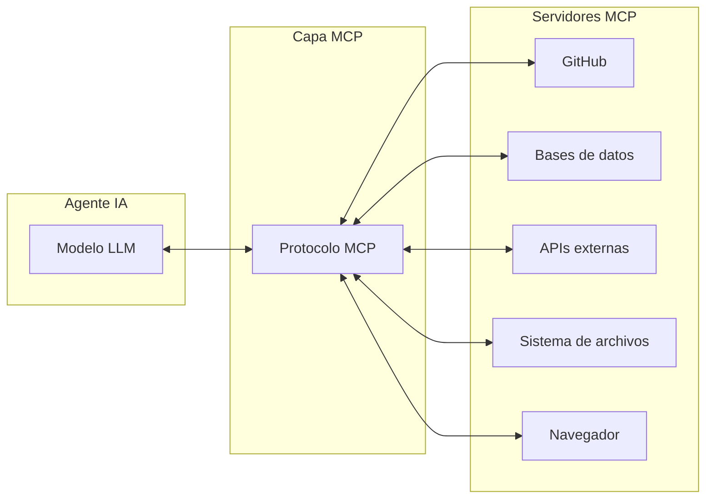
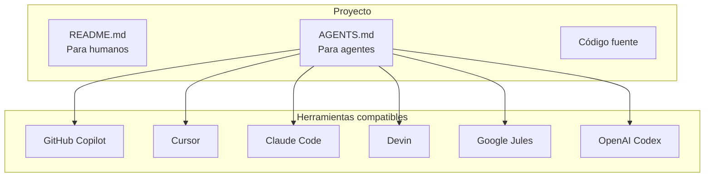
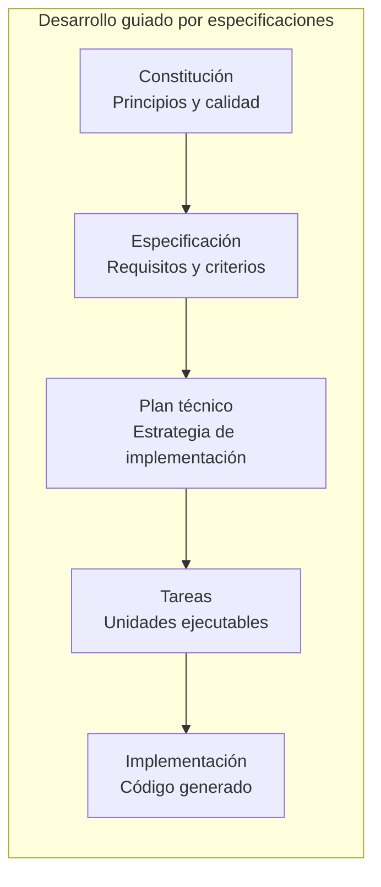
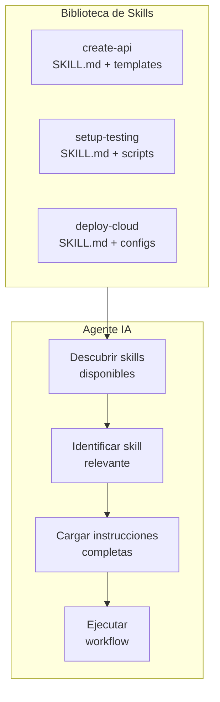
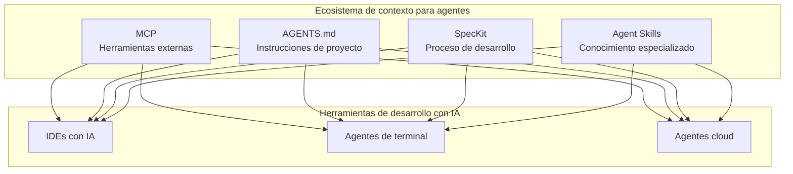

Autor: Alan Sastre

GitHub: [github.com/alansastre/genai-asistentes-codigo](https://github.com/alansastre/genai-asistentes-codigo)

Los agentes de IA para desarrollo de código necesitan **comprender el contexto** en el que operan para generar resultados útiles. Un modelo de lenguaje aislado, sin información sobre el proyecto, las convenciones del equipo o las herramientas disponibles, produce código genérico que rara vez se adapta a las necesidades reales. Por esta razón, han surgido diversos **estándares y especificaciones** que permiten proporcionar contexto estructurado a los agentes de forma consistente y portable.

Estos estándares abordan diferentes aspectos del problema: desde cómo conectar agentes con herramientas externas, hasta cómo definir instrucciones específicas para un proyecto o cómo extender las capacidades de un agente con conocimientos especializados. La adopción de estos formatos abiertos permite que las instrucciones y configuraciones funcionen de manera uniforme en múltiples herramientas y proveedores.

## Context Engineering

El término **Context Engineering** ha emergido como la evolución natural del prompt engineering. Mientras que el prompt engineering se centraba en la redacción de instrucciones y ejemplos específicos, el context engineering aborda la **curación holística de toda la información** que recibe un modelo durante su ejecución.

Los agentes modernos operan durante múltiples turnos de inferencia y horizontes temporales extensos, generando progresivamente más datos que podrían ser relevantes. El desafío de ingeniería consiste en decidir qué información cabe en la ventana de contexto limitada para producir el comportamiento deseado de forma consistente.

El diagrama ilustra las **capas de la pila de contexto** que un agente debe gestionar. Cada capa tiene su propio ciclo de vida y debe ser curada de forma coherente para maximizar la calidad de las respuestas.

> Investigaciones recientes sugieren que optimizar únicamente las instrucciones del prompt deja sin abordar el 70% de lo que hace que un agente sea fiable. La calidad del agente depende de la gestión de toda la pila de contexto.

Los estándares que se describen a continuación proporcionan **mecanismos formales** para gestionar diferentes capas de esta pila de contexto, desde las herramientas disponibles hasta las instrucciones específicas del proyecto.

## Model Context Protocol (MCP)

[Model Context Protocol](https://modelcontextprotocol.io/) | Noviembre 2024

El **Model Context Protocol** (MCP) es un estándar abierto desarrollado por Anthropic que define cómo los agentes de IA se conectan con sistemas externos. Funciona como un **puerto USB-C para aplicaciones de IA**: proporciona una interfaz estandarizada para que los modelos accedan a fuentes de datos, herramientas y flujos de trabajo externos.

Antes de MCP, cada herramienta de IA implementaba sus propias integraciones con servicios externos, lo que resultaba en **ecosistemas fragmentados** e incompatibles. MCP establece un protocolo común que permite:

- **Acceso a datos personales**: calendarios, notas, documentos
- **Interacción con herramientas**: buscadores, calculadoras, sistemas de diseño
- **Conexión empresarial**: bases de datos organizacionales, APIs internas
- **Control de aplicaciones**: navegadores, terminales, editores de código

La adopción de MCP se ha extendido más allá de Anthropic. Plataformas como OpenAI, Google, AWS y la mayoría de IDEs con IA nativa han implementado soporte para el protocolo, creando un ecosistema donde los **servidores MCP son reutilizables** entre diferentes herramientas y proveedores.

> MCP transforma a los agentes de herramientas de generación de código a asistentes capaces de interactuar con sistemas reales: ejecutar tests, consultar documentación actualizada, gestionar repositorios y depurar aplicaciones.

El protocolo continúa evolucionando con extensiones como MCP Apps, que añaden capacidades de interfaz de usuario a las integraciones.

## AGENTS.md

[AGENTS.md](https://agents.md/) | Agosto 2025

**AGENTS.md** es un formato abierto y sencillo para proporcionar contexto e instrucciones a los agentes de codificación. Se puede entender como un **README para agentes**: un lugar dedicado y predecible donde definir cómo deben trabajar los agentes de IA en un proyecto específico.

La propuesta surge de la necesidad de separar la documentación dirigida a humanos de las instrucciones específicas para agentes. Un README tradicional describe el proyecto para desarrolladores humanos, mientras que AGENTS.md contiene información que podría resultar verbosa o irrelevante para contribuidores humanos pero que es esencial para los agentes:

- **Comandos de configuración**: instalación de dependencias, inicio del servidor de desarrollo, ejecución de tests
- **Convenciones de código**: preferencias de lenguaje, reglas de formato, patrones a seguir
- **Guías específicas del proyecto**: estructura de carpetas, decisiones arquitectónicas, restricciones técnicas

La ventaja principal de AGENTS.md es su **interoperabilidad**: un único archivo proporciona definiciones compatibles con un ecosistema creciente de herramientas. El formato ha sido adoptado por más de 60.000 proyectos open-source y es soportado por las principales herramientas de desarrollo con IA, incluyendo GitHub Copilot, Cursor, Claude Code, Devin, Google Jules y OpenAI Codex.

> AGENTS.md complementa a README.md: mantiene los READMEs concisos mientras proporciona guía precisa y enfocada para los agentes que trabajan en el código.

## Spec Driven Development con GitHub SpecKit

[GitHub SpecKit](https://github.com/github/spec-kit) | Agosto 2025

**SpecKit** es un toolkit open-source de GitHub que propone un cambio de paradigma en el desarrollo con IA: en lugar de tratar el código como elemento primario, las **especificaciones se convierten en la fuente de verdad** que guía la implementación.

El enfoque surge como respuesta al problema del **vibe coding**, donde los desarrolladores describen objetivos vagos y aceptan código generado sin comprenderlo completamente. SpecKit trata a los agentes de IA como programadores literales que requieren instrucciones no ambiguas para producir resultados predecibles.

El flujo de trabajo de SpecKit guía el desarrollo a través de etapas estructuradas:

1. **Constitución**: definición de principios, estándares de calidad y requisitos de testing
2. **Especificación**: historias de usuario, requisitos funcionales y criterios de éxito
3. **Clarificación**: resolución iterativa de ambigüedades en los requisitos
4. **Plan técnico**: estrategia de implementación y secuenciación
5. **Tareas**: descomposición en unidades ejecutables
6. **Implementación**: generación de código basada en las especificaciones

SpecKit es principalmente un conjunto de **plantillas markdown y agentes predefinidos**. No genera código directamente, sino que estructura el proceso para que los asistentes de IA existentes produzcan resultados más predecibles y mantenibles.

> En lugar de generar código inmediatamente, SpecKit primero crea especificaciones detalladas que reducen la ambigüedad y mejoran la calidad del resultado final.

## Agent Skills

[Agent Skills](https://agentskills.io/) | Diciembre 2025

**Agent Skills** es un formato abierto para extender las capacidades de los agentes de IA con conocimientos especializados y flujos de trabajo reutilizables. Originalmente desarrollado por Anthropic, ha sido liberado como estándar abierto y adoptado por las principales herramientas de desarrollo con IA.

En esencia, un Agent Skill es una carpeta que contiene un archivo `SKILL.md` con metadatos e instrucciones, junto con scripts, plantillas y materiales de referencia opcionales. El formato utiliza **divulgación progresiva** para gestionar el contexto de forma eficiente: los agentes cargan inicialmente solo los nombres y descripciones de las skills disponibles, activando las instrucciones completas únicamente cuando una tarea coincide con el propósito de una skill específica.

Las Agent Skills permiten:

- **Experiencia de dominio**: empaquetar conocimiento especializado en instrucciones reutilizables
- **Nuevas capacidades**: dotar a los agentes de habilidades como crear presentaciones, construir servidores MCP o analizar datasets
- **Flujos de trabajo repetibles**: convertir tareas de múltiples pasos en procesos consistentes y auditables
- **Interoperabilidad**: reutilizar skills entre diferentes productos de agentes compatibles

> Las Agent Skills son autodocumentadas, extensibles y portables como simples carpetas de archivos, facilitando su compartición y reutilización entre equipos y herramientas.

## Panorama de estándares de contexto

La tabla siguiente resume los estándares presentados y su propósito específico dentro del ecosistema de desarrollo con IA:

| Estándar | Propósito | Lanzamiento |
|----------|-----------|-------------|
| [MCP](https://modelcontextprotocol.io/) | Conexión con herramientas y datos externos | Noviembre 2024 |
| [AGENTS.md](https://agents.md/) | Instrucciones de proyecto para agentes | Agosto 2025 |
| [SpecKit](https://github.com/github/spec-kit) | Desarrollo guiado por especificaciones | Agosto 2025 |
| [Agent Skills](https://agentskills.io/) | Extensión de capacidades con conocimiento especializado | Diciembre 2025 |

Estos estándares son **complementarios**, no excluyentes. Un proyecto puede utilizar AGENTS.md para definir convenciones generales, MCP para conectar con herramientas externas, SpecKit para estructurar el proceso de desarrollo y Agent Skills para proporcionar conocimientos especializados al agente.

> La convergencia hacia estándares abiertos para proporcionar contexto a los agentes de IA refleja la maduración del ecosistema: las herramientas compiten en experiencia de usuario y capacidades, pero comparten formatos comunes que benefician a toda la comunidad de desarrolladores.

En las siguientes lecciones del curso se profundizará en la configuración y uso práctico de estos estándares en proyectos reales.
