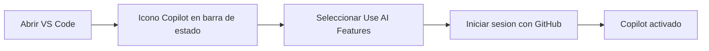

Autor: Alan Sastre

GitHub: [github.com/alansastre/genai-asistentes-codigo](https://github.com/alansastre/genai-asistentes-codigo)

GitHub Copilot es un asistente de programación basado en inteligencia artificial que se integra directamente en Visual Studio Code. Para utilizarlo, es necesario tener instalado el editor, disponer de una cuenta de GitHub y activar las funcionalidades de IA dentro del propio VS Code.

## Instalación de Visual Studio Code

Visual Studio Code es un **editor de código fuente** gratuito y de código abierto desarrollado por Microsoft. Está disponible para Windows, macOS y Linux, y es el editor más utilizado por desarrolladores en todo el mundo.

Para descargarlo, accede a la página oficial:

> **Enlace de descarga**: [https://code.visualstudio.com/download](https://code.visualstudio.com/download)

Una vez en la página, selecciona la versión correspondiente a tu sistema operativo:

* **Windows**: descarga el instalador `.exe` y ejecútalo. Sigue los pasos del asistente de instalación aceptando las opciones por defecto.
* **macOS**: descarga el archivo `.zip`, descomprímelo y arrastra la aplicación a la carpeta de Aplicaciones.
* **Linux**: están disponibles paquetes `.deb` para distribuciones basadas en Debian/Ubuntu y `.rpm` para distribuciones basadas en Fedora/Red Hat.

Tras la instalación, abre Visual Studio Code para verificar que funciona correctamente. El editor se iniciará mostrando la pantalla de bienvenida.

## Creación de una cuenta de GitHub

GitHub Copilot requiere una **cuenta de GitHub** para funcionar. Si ya dispones de una cuenta, puedes saltar esta sección. En caso contrario, sigue estos pasos para crear una:

> **Registro en GitHub**: [https://github.com/signup](https://github.com/signup)

El proceso de registro es sencillo:

* **1. Introduce tu correo electrónico**: GitHub te pedirá una dirección de correo electrónico válida que servirá como identificador de tu cuenta.

* **2. Crea una contraseña**: elige una contraseña segura que cumpla con los requisitos mínimos de seguridad.

* **3. Elige un nombre de usuario**: este será tu identificador público en GitHub y aparecerá en la URL de tu perfil.

* **4. Verifica tu cuenta**: GitHub te enviará un código de verificación al correo electrónico proporcionado.

* **5. Personaliza tu experiencia**: opcionalmente, GitHub te preguntará sobre tus preferencias y experiencia para personalizar las recomendaciones.

Una vez completado el registro, tendrás acceso a tu cuenta de GitHub y podrás vincularla con Visual Studio Code.

## Activación de GitHub Copilot en VS Code

Las versiones actuales de Visual Studio Code incluyen **integración nativa** con GitHub Copilot, por lo que no es necesario instalar ninguna extensión adicional. La activación se realiza directamente desde el propio editor.

### Pasos para activar Copilot

Sigue estos pasos para habilitar las funcionalidades de IA:

* **1. Localiza el icono de Copilot**: en la barra de estado inferior de VS Code, busca el icono de Copilot. Al pasar el cursor sobre él, aparecerá un menú contextual.

* **2. Selecciona "Use AI Features"**: haz clic en esta opción para iniciar el proceso de activación.

* **3. Inicia sesión con GitHub**: VS Code te redirigirá a GitHub para autenticarte. Si ya tienes la sesión iniciada en el navegador, el proceso será automático. En caso contrario, introduce tus credenciales.

* **4. Autoriza el acceso**: GitHub te pedirá que autorices a VS Code para acceder a tu cuenta. Acepta los permisos solicitados.

Una vez completado este proceso, el icono de Copilot en la barra de estado cambiará para indicar que está activo y listo para usar.

> Si no dispones de una suscripción previa a GitHub Copilot, VS Code te registrará automáticamente en el **plan gratuito** (Copilot Free), que incluye un límite mensual de sugerencias de código y mensajes de chat.

### Planes disponibles

GitHub Copilot ofrece diferentes niveles de suscripción:

| Plan | Precio | Sugerencias inline | Peticiones premium |
|------|--------|-------------------|-------------------|
| **Free** | Gratuito | 2.000/mes | 50/mes |
| **Pro** | $10/mes | Ilimitadas | 300/mes |
| **Pro+** | $39/mes | Ilimitadas | 1.500/mes |

El plan gratuito es suficiente para explorar las capacidades del asistente y comenzar a integrarlo en tu flujo de trabajo de desarrollo. Los contadores de uso se reinician el primer día de cada mes.

## Verificación de la instalación

Para confirmar que GitHub Copilot está funcionando correctamente, crea un nuevo archivo con extensión `.py` o `.js` y comienza a escribir código. Copilot debería empezar a mostrar **sugerencias inline** en color gris mientras escribes.

También puedes abrir el panel de chat de Copilot mediante el atajo de teclado `Ctrl+Alt+I` en Windows/Linux o `Cmd+Alt+I` en macOS. Si el panel se abre y puedes enviar mensajes, la configuración se ha completado correctamente.

> **Solución de problemas**: si el icono de Copilot muestra un estado de error, verifica que tu sesión de GitHub esté activa seleccionando el menú de cuentas en la barra lateral izquierda de VS Code.

La configuración de telemetría viene habilitada por defecto en el plan gratuito. Si deseas desactivarla, puedes hacerlo desde la configuración de VS Code estableciendo `telemetry.telemetryLevel` a `off`, o directamente en la [configuración de Copilot en GitHub](https://github.com/settings/copilot).

