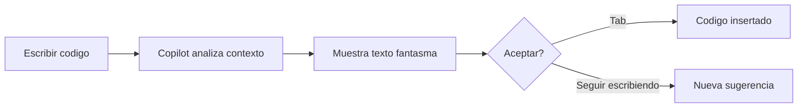

Autor: Alan Sastre

GitHub: [github.com/alansastre/genai-asistentes-codigo](https://github.com/alansastre/genai-asistentes-codigo)

GitHub Copilot ofrece asistencia de programación directamente en el editor mientras escribes código. Estas sugerencias aparecen de forma automática sin necesidad de abrir ningún panel adicional, lo que permite mantener el flujo de trabajo sin interrupciones. Existen dos tipos principales de sugerencias: las **sugerencias inline** que completan el código mientras escribes y las **sugerencias de próxima edición** que predicen qué cambios necesitarás hacer a continuación.

## Sugerencias inline

Las sugerencias inline son el mecanismo principal de asistencia de GitHub Copilot. Mientras escribes código, Copilot analiza el contexto del archivo actual y de los archivos abiertos en el editor para ofrecer completados relevantes. Estas sugerencias aparecen como **texto fantasma** (ghost text) en color atenuado directamente en la posición del cursor.



### Aceptar sugerencias completas

Cuando aparece una sugerencia que resulta útil, basta con pulsar la tecla `Tab` para aceptarla e insertarla en el código. Las sugerencias pueden variar desde una simple línea hasta bloques completos de código, incluyendo funciones enteras o estructuras de datos.

Por ejemplo, al escribir la firma de una función:

```python .noeval
def calculate_days_between_dates(
```

Copilot puede sugerir automáticamente la implementación completa de la función, incluyendo los parámetros, el cuerpo y el valor de retorno.

> Las sugerencias de Copilot son **no deterministas**, lo que significa que pueden variar entre ejecuciones. El mismo inicio de código puede producir diferentes sugerencias en diferentes momentos.

### Aceptar sugerencias parciales

En ocasiones, solo una parte de la sugerencia es útil. En lugar de aceptar todo el bloque propuesto, es posible aceptar únicamente una porción:

* **Aceptar la siguiente palabra**: `Ctrl+Derecha` en Windows/Linux o `Cmd+Derecha` en macOS
* **Aceptar la siguiente línea**: utilizando el mismo atajo repetidamente

Esta funcionalidad resulta especialmente útil cuando Copilot sugiere código que va en la dirección correcta pero requiere ajustes específicos.

### Explorar sugerencias alternativas

Copilot puede generar **múltiples sugerencias** para el mismo contexto. Para navegar entre ellas:

* Coloca el cursor sobre el texto fantasma para ver los controles de navegación
* Usa `Alt+]` para ver la siguiente sugerencia
* Usa `Alt+[` para ver la sugerencia anterior

Esta navegación permite explorar diferentes aproximaciones al mismo problema antes de decidir cuál implementar.

## Sugerencias de próxima edición

Las sugerencias de próxima edición, conocidas como **Copilot NES** (Next Edit Suggestions), representan una evolución de las sugerencias inline. En lugar de solo completar código nuevo, NES predice qué ediciones necesitarás realizar a continuación y dónde se ubicarán esos cambios.

Esta funcionalidad resulta especialmente útil cuando se realizan cambios que requieren modificaciones coordinadas en múltiples ubicaciones del código. Por ejemplo, al renombrar una variable, Copilot puede sugerir actualizar todas las referencias a esa variable en el archivo.

### Activar sugerencias de próxima edición

Para habilitar esta funcionalidad, es necesario activar la configuración correspondiente en VS Code:

* Abre la configuración de VS Code (`Ctrl+,` o `Cmd+,`)
* Busca `github.copilot.nextEditSuggestions.enabled`
* Activa la opción

Una vez habilitada, aparecerá una **flecha en el margen izquierdo** del editor cuando haya una sugerencia de edición disponible. La dirección de la flecha indica la posición relativa de la sugerencia respecto al cursor actual.

### Navegar y aceptar ediciones

El flujo de trabajo con NES utiliza la tecla `Tab` de forma consecutiva:

* **Primer Tab**: navega hasta la ubicación de la sugerencia
* **Segundo Tab**: acepta la edición propuesta

Este mecanismo permite moverse rápidamente entre las ediciones sugeridas sin necesidad de buscar manualmente las ubicaciones afectadas.

### Casos de uso comunes

Las sugerencias de próxima edición son particularmente efectivas en varios escenarios:

**Corrección de errores tipográficos**

Cuando escribes `improt pandas` en lugar de `import pandas`, Copilot puede detectar el error y sugerir la corrección automáticamente.

**Cambio de intención**

Si cambias el nombre de una clase de `Point` a `Point3D`, Copilot puede sugerir añadir un atributo `z` a la clase y actualizar los métodos relacionados.

**Refactorización**

Al renombrar una variable o función en una ubicación, Copilot sugiere actualizar las demás referencias en el archivo para mantener la consistencia.

**Adaptación de código copiado**

Cuando pegas código de otra fuente, Copilot puede sugerir ajustes para que coincida con el estilo y las convenciones del código existente.

## Generar código desde comentarios

Una técnica efectiva para guiar las sugerencias de Copilot consiste en escribir **comentarios descriptivos** antes del código. Copilot interpreta estos comentarios como instrucciones y genera implementaciones acordes.

Por ejemplo, el siguiente comentario en Python:

```python .noeval
# Clase que representa un estudiante con nombre, edad y calificaciones
# Incluye métodos para calcular el promedio y verificar si aprobó
```

Puede generar una clase completa con las propiedades y métodos descritos. Los comentarios pueden especificar:

* **Algoritmos específicos**: "usar recursión" o "implementar con programación dinámica"
* **Patrones de diseño**: "aplicar el patrón singleton" o "usar factory method"
* **Requisitos funcionales**: "validar que el email tenga formato correcto"

> Los comentarios actúan como **prompts naturales** que orientan las sugerencias de Copilot hacia implementaciones específicas.

## Contexto y archivos abiertos

La calidad de las sugerencias de Copilot depende directamente del **contexto disponible**. Copilot analiza:

* El archivo actual donde se está escribiendo
* Los archivos abiertos en otras pestañas del editor
* La estructura del proyecto visible

Mantener abiertos archivos relacionados mejora significativamente la relevancia de las sugerencias. Por ejemplo, al trabajar en un servicio que consume una API, tener abierto el archivo con las definiciones de tipos o interfaces ayuda a Copilot a generar código coherente con esas estructuras.

## Gestionar las sugerencias

### Pausar sugerencias temporalmente

En situaciones donde las sugerencias resultan distractoras, es posible pausarlas temporalmente:

* Haz clic en el icono de Copilot en la barra de estado
* Selecciona **Snooze** para pausar por intervalos de cinco minutos
* Selecciona **Cancel Snooze** para reanudar las sugerencias

También puedes usar los comandos **Snooze Inline Suggestions** y **Cancel Snooze Inline Suggestions** desde la paleta de comandos (`Ctrl+Shift+P` o `Cmd+Shift+P`).

### Deshabilitar sugerencias por lenguaje

Las sugerencias pueden habilitarse o deshabilitarse de forma selectiva para lenguajes específicos:

* Abre el menú de Copilot en la barra de estado
* Marca o desmarca las opciones de sugerencias inline
* La opción de deshabilitar para un lenguaje específico aparece según el tipo de archivo activo

Esta configuración resulta útil cuando las sugerencias son más valiosas en ciertos lenguajes que en otros.

## Cambiar el modelo de IA

GitHub Copilot permite seleccionar entre diferentes **modelos de lenguaje** para generar las sugerencias. Cada modelo tiene características distintas en términos de velocidad, precisión y capacidades.

Para cambiar el modelo:

* Abre la paleta de comandos (`Ctrl+Shift+P` o `Cmd+Shift+P`)
* Ejecuta el comando **GitHub Copilot: Change Completions Model**
* Selecciona el modelo deseado de la lista disponible

> La disponibilidad de modelos puede variar según el plan de suscripción y las políticas de la organización. Los administradores pueden habilitar o restringir el acceso a modelos específicos.

## Configuraciones adicionales

VS Code ofrece varias opciones para personalizar el comportamiento de las sugerencias:

| Configuración | Descripción |
|---------------|-------------|
| `github.copilot.enable` | Habilita o deshabilita sugerencias por lenguaje |
| `editor.inlineSuggest.showToolbar` | Muestra u oculta la barra de herramientas de sugerencias |
| `editor.inlineSuggest.syntaxHighlightingEnabled` | Activa el resaltado de sintaxis en las sugerencias |
| `github.copilot.nextEditSuggestions.enabled` | Activa las sugerencias de próxima edición |
| `editor.inlineSuggest.edits.showCollapsed` | Muestra las ediciones colapsadas hasta navegar a ellas |

Estas configuraciones se encuentran en la configuración de VS Code y pueden ajustarse según las preferencias personales de cada desarrollador.
