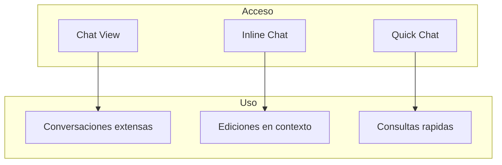
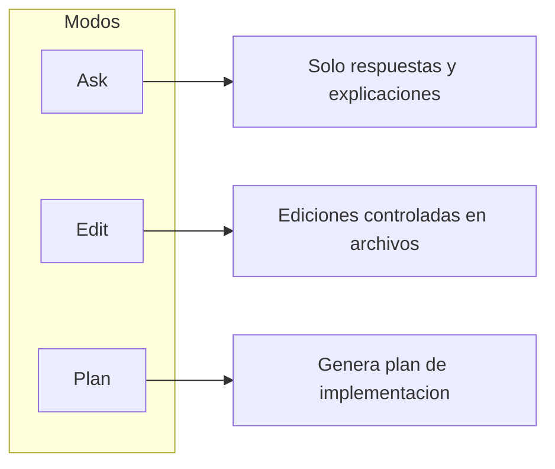
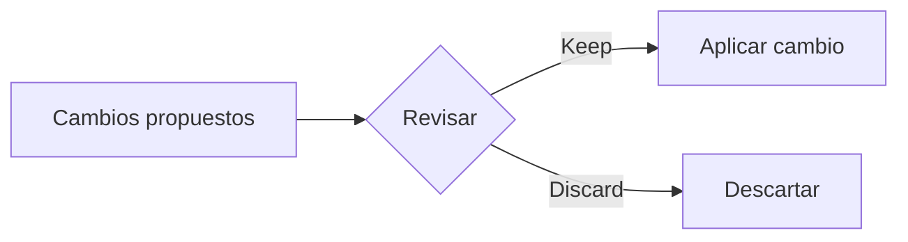
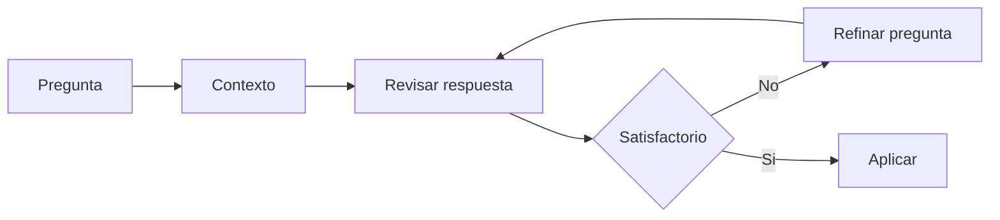

Autor: Alan Sastre

GitHub: [github.com/alansastre/genai-asistentes-codigo](https://github.com/alansastre/genai-asistentes-codigo)

**GitHub Copilot Chat** es la interfaz conversacional que permite interactuar con modelos de IA mediante lenguaje natural. A diferencia de las sugerencias inline, el chat ofrece una experiencia más interactiva donde puedes hacer preguntas sobre el código, solicitar explicaciones, pedir modificaciones y obtener ayuda con tareas de programación.

## Formas de acceder al chat

Visual Studio Code proporciona tres formas de iniciar una conversación con Copilot, cada una optimizada para diferentes flujos de trabajo.



### Chat View

El **Chat View** es la interfaz principal para conversaciones extensas. Se abre desde el menú **Chat** en la barra de título de VS Code, o mediante el atajo de teclado:

| Sistema | Atajo |
|---------|-------|
| Windows/Linux | `Ctrl+Alt+I` |
| macOS | `Cmd+Option+I` |

El panel permanece visible en la barra lateral y mantiene el historial de la conversación. Permite hacer preguntas de seguimiento y refinar las respuestas aprovechando el contexto de mensajes anteriores.

Si prefieres más espacio, puedes abrir el chat como pestaña del editor seleccionando **New Chat Editor** desde el menú, o como ventana independiente con **New Chat Window**.

### Inline Chat

El **Inline Chat** aparece directamente dentro del editor, en la línea donde está el cursor. Es ideal para ediciones puntuales sin cambiar de contexto:

| Sistema | Atajo |
|---------|-------|
| Windows/Linux | `Ctrl+I` |
| macOS | `Cmd+I` |

Las sugerencias aparecen como un diff que se puede aceptar o rechazar antes de aplicar los cambios al código. El Inline Chat es útil para refactorizaciones rápidas, generación de documentación o corrección de errores en un fragmento específico.

### Quick Chat

**Quick Chat** es un desplegable que aparece en la parte superior del editor, diseñado para consultas rápidas que no requieren mantener abierto el panel:

| Sistema | Atajo |
|---------|-------|
| Windows/Linux | `Ctrl+Shift+Alt+L` |
| macOS | `Shift+Option+Cmd+L` |

Tras obtener la respuesta, el desplegable se cierra automáticamente sin interrumpir el flujo de trabajo.

> También puedes iniciar el chat directamente desde la línea de comandos ejecutando `code chat`.

## Modos del chat

El Chat View incluye un **selector de modos** en la parte inferior que permite cambiar el comportamiento de Copilot según el tipo de tarea. Cada modo está optimizado para un caso de uso específico.



### Modo Ask

El modo **Ask** está optimizado para responder preguntas sin realizar cambios en el código. Proporciona explicaciones, sugerencias conceptuales y ayuda para entender cómo funciona el código.

**Casos de uso recomendados:**

* Entender cómo funciona una parte del código
* Explorar ideas y alternativas de implementación
* Obtener ayuda con conceptos de programación
* Preguntas generales sobre tecnologías o frameworks

**Ejemplo de prompt:**

```plaintext .noeval
Explica cómo funciona el patrón decorator en Python y cuándo debería usarlo
```

Las respuestas incluyen bloques de código que puedes aplicar individualmente pasando el cursor sobre ellos y seleccionando **Apply in Editor**.

### Modo Edit

El modo **Edit** permite realizar ediciones controladas en archivos específicos. A diferencia de otros modos, el usuario mantiene control total sobre qué archivos se modifican.

**Casos de uso recomendados:**

* Refactorizaciones en un conjunto definido de archivos
* Añadir funcionalidad a código existente
* Corrección de errores cuando sabes dónde está el problema

**Ejemplo de prompt:**

```plaintext .noeval
Añade validación de email a la función register_user
```

Los cambios se aplican directamente en el editor con controles de navegación que permiten revisar cada edición. Puedes usar los botones de la barra de herramientas para navegar entre ediciones y aceptar o descartar cada una.

### Modo Plan

El modo **Plan** genera un plan de implementación estructurado antes de ejecutar cambios. Analiza el codebase, identifica los pasos necesarios y puede hacer preguntas de clarificación.

**Casos de uso recomendados:**

* Planificar implementaciones de funcionalidades complejas
* Documentar el enfoque técnico antes de implementar
* Dividir tareas grandes en pasos manejables

**Ejemplo de prompt:**

```plaintext .noeval
Planifica cómo añadir un sistema de autenticación con JWT a esta API
```

Una vez revisado el plan, puedes seleccionar **Start Implementation** para que Copilot ejecute los pasos definidos.

> El modo **Agent** para tareas autónomas complejas se explica en detalle en la siguiente lección.

## Añadir contexto a los prompts

Para obtener respuestas más precisas, Copilot permite añadir **contexto específico** a las preguntas. El contexto ayuda al modelo a entender mejor el problema y proporcionar soluciones más relevantes.

### Herramientas de contexto

Las herramientas de contexto se invocan escribiendo `#` seguido del nombre. Las más utilizadas son:

| Herramienta | Descripción |
|-------------|-------------|
| `#codebase` | Busca y analiza código en todo el proyecto |
| `#fetch` | Obtiene contenido de URLs externas |
| `#githubRepo` | Busca información en repositorios de GitHub |
| `#terminalSelection` | Accede a la salida seleccionada en la terminal |

**Ejemplo de uso:**

```plaintext .noeval
#codebase ¿dónde está configurada la conexión a la base de datos?
```

### Añadir contexto manualmente

El Chat View incluye opciones para adjuntar contexto adicional:

* **Archivos y carpetas**: arrastra archivos al panel de chat o usa el botón de adjuntar
* **Selección de código**: selecciona texto en el editor antes de abrir el chat
* **Imágenes**: pega capturas de pantalla con `Ctrl+V` / `Cmd+V`

Mantener abiertos archivos relacionados en el editor también mejora la relevancia de las respuestas, ya que Copilot analiza el contexto visible.

## Revisar ediciones propuestas

Cuando Copilot propone cambios en el código, estos aparecen como **diffs** en el editor. VS Code proporciona controles para revisar y gestionar estos cambios antes de aplicarlos.



### Controles de navegación

La barra de herramientas del editor incluye controles para:

* **Navegar entre ediciones**: botones arriba/abajo para saltar entre cambios
* **Keep**: aplicar los cambios propuestos
* **Discard**: rechazar los cambios y mantener el código original

Las ediciones se muestran con resaltado de sintaxis indicando las líneas añadidas y eliminadas, facilitando la comparación con el código original.

## Sesiones de chat

El Chat View permite trabajar con **múltiples sesiones** de forma simultánea. Cada sesión mantiene su propio historial y contexto.

Para crear una nueva sesión, haz clic en el icono **+** en la parte superior del Chat View. Las sesiones existentes aparecen en un historial accesible desde el mismo panel.

Cada sesión recuerda:

* Los archivos y fragmentos de código mencionados
* Las respuestas anteriores
* El modo seleccionado (Ask, Edit, Plan)

> Usa sesiones separadas para tareas distintas. Esto evita que el contexto de una tarea interfiera con otra y mejora la precisión de las respuestas.

## Selección de modelos

Copilot Chat permite cambiar el **modelo de IA** que genera las respuestas. El selector de modelos aparece en la parte inferior del Chat View.

Diferentes modelos tienen fortalezas distintas:

| Categoría | Características |
|-----------|-----------------|
| **Modelos rápidos** | Respuestas inmediatas, ideales para tareas simples |
| **Modelos de razonamiento** | Capacidades avanzadas para tareas complejas |

Para cambiar el modelo:

* Haz clic en el selector de modelos en el Chat View
* Selecciona el modelo deseado de la lista disponible

> La lista de modelos disponibles varía según tu suscripción y puede cambiar con el tiempo. Algunos modelos consumen **premium requests** de tu cuota mensual.

## Uso de imágenes

Copilot Chat puede analizar **imágenes** adjuntas al prompt. Esta funcionalidad permite:

* Generar código desde mockups de interfaces
* Describir diagramas y flujos
* Replicar diseños de páginas web
* Explicar código a partir de capturas de pantalla

**Formatos soportados:** JPEG, PNG, GIF, WEBP

Para adjuntar una imagen:

* **Pegar** desde el portapapeles con `Ctrl+V` / `Cmd+V`
* **Arrastrar** archivos de imagen al panel de chat

## Personalización del chat

Copilot Chat puede adaptar sus respuestas según instrucciones personalizadas definidas a nivel de proyecto.

### Instrucciones personalizadas

Las instrucciones personalizadas son preferencias que aplican a todas las conversaciones. Se definen en un archivo `.github/copilot-instructions.md` en el repositorio:

```markdown .noeval
# Instrucciones para Copilot

## Estilo de código
- Usar Python con type hints
- Seguir PEP 8
- Documentar con docstrings

## Convenciones
- Nombres de variables en snake_case
- Clases en PascalCase
```

Estas instrucciones se aplican automáticamente a todas las conversaciones del proyecto.

## Buenas prácticas

Para obtener respuestas más precisas de Copilot Chat:

* **Sé específico**: incluye detalles sobre el lenguaje, framework y contexto
* **Proporciona contexto**: usa herramientas como `#codebase` para dar información relevante
* **Selecciona el modo adecuado**: usa Ask para preguntas, Edit para modificaciones, Plan para tareas complejas
* **Itera**: haz preguntas de seguimiento para refinar las respuestas
* **Revisa siempre**: valida el código generado antes de aplicarlo


