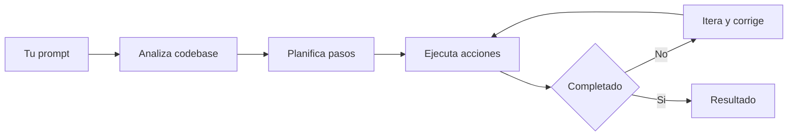
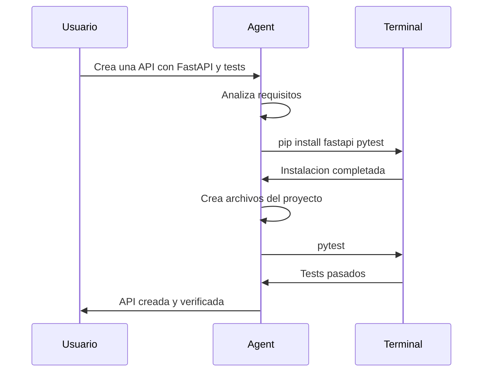
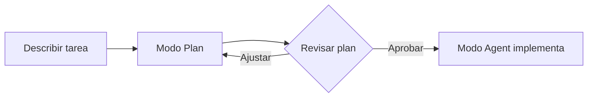

Autor: Alan Sastre

GitHub: [github.com/alansastre/genai-asistentes-codigo](https://github.com/alansastre/genai-asistentes-codigo)

El modo **Agent** es el modo más autónomo de GitHub Copilot Chat. A diferencia de los modos Ask, Edit y Plan que vimos anteriormente, Agent trabaja de forma **completamente autónoma**: analiza el problema, decide qué archivos modificar, ejecuta comandos en la terminal y aplica cambios iterativamente hasta completar la tarea.

## Agent vs Edit: la diferencia clave

Ambos modos pueden modificar archivos, pero la diferencia fundamental está en **quién toma las decisiones**:

| Aspecto | Edit | Agent |
|---------|------|-------|
| Decide qué archivos modificar | El usuario | El agente |
| Ejecuta comandos de terminal | No | Sí |
| Itera automáticamente | No | Sí |
| Usa herramientas externas | Limitado | Completo |
| Nivel de autonomía | Controlado | Autónomo |

El modo **Edit** es útil cuando sabes exactamente qué archivos necesitan cambios y quieres mantener control sobre el alcance de las modificaciones. El modo **Agent** es para tareas donde prefieres delegar la planificación y ejecución completa al asistente.

> El modo Agent existe porque hay tareas complejas que requieren tomar múltiples decisiones, ejecutar comandos y adaptarse según los resultados. Edit no puede hacer esto porque está diseñado para cambios puntuales y controlados.

## Funcionamiento del modo Agent

Cuando envías un prompt en modo Agent, Copilot ejecuta un ciclo autónomo:



El agente puede:

* **Leer y analizar** archivos del proyecto para entender el contexto
* **Crear y modificar** múltiples archivos según sea necesario
* **Ejecutar comandos** en la terminal integrada
* **Verificar resultados** y corregir errores automáticamente
* **Iterar** hasta que la tarea esté completa

## Activar el modo Agent

Para usar el modo Agent:

* Abre el panel de chat con `Ctrl+Alt+I` (Windows/Linux) o `Cmd+Option+I` (macOS)
* Selecciona **Agent** en el selector de modos de la parte inferior

El modo Agent debe estar habilitado en la configuración de VS Code. Si no aparece en el selector, verifica que la opción `chat.agent.enabled` esté activada.

## Ejecución de comandos de terminal

Una capacidad exclusiva del modo Agent es la ejecución de comandos en la terminal. Esto permite al agente:

* Instalar dependencias (`pip install`, `npm install`)
* Ejecutar scripts de build y tests
* Iniciar servidores de desarrollo
* Verificar que los cambios funcionan correctamente



### Terminales del agente

Cada sesión de Agent crea terminales dedicadas identificables por un icono especial. Estas terminales persisten durante la sesión, permitiendo revisar el historial de comandos ejecutados.

## Aprobación de acciones

Por seguridad, el agente solicita **aprobación** antes de ejecutar ciertas acciones:

| Acción | Requiere aprobación |
|--------|---------------------|
| Leer archivos | No |
| Modificar archivos | Sí (primera vez por sesión) |
| Ejecutar comandos de terminal | Configurable |
| Acceder a URLs externas | Sí |

Cuando aparece el diálogo de aprobación, puedes elegir:

* **Allow Once**: permite solo esta vez
* **Allow for Session**: permite durante toda la sesión
* **Allow for Workspace**: permite siempre en este proyecto
* **Always Allow**: permite en cualquier proyecto

### Proteger archivos sensibles

Puedes configurar archivos que requieran confirmación adicional antes de ser modificados:

```json
{
  "chat.editing.protectedPatterns": [
    ".env",
    "*.secret",
    "config/production.json"
  ]
}
```

## Herramientas del agente

El modo Agent utiliza **herramientas** para realizar acciones específicas. VS Code incluye herramientas integradas que el agente puede invocar automáticamente:

| Herramienta | Descripción |
|-------------|-------------|
| Análisis de codebase | Busca y analiza código en el proyecto |
| Lectura de archivos | Accede al contenido de archivos |
| Terminal | Ejecuta comandos en la terminal |
| Problemas del editor | Accede a errores y warnings |

Además, el agente puede utilizar herramientas adicionales proporcionadas por extensiones de VS Code o servidores MCP configurados en el proyecto.

### Configurar herramientas activas

Para gestionar qué herramientas están disponibles:

* Haz clic en el botón de herramientas en el panel de chat
* Activa o desactiva las herramientas según la tarea

> Menos herramientas activas mejoran la precisión. Activa solo las relevantes para tu tarea actual.

## Checkpoints

Durante su trabajo, el agente crea **checkpoints** automáticos que permiten volver a estados anteriores. Estos puntos de restauración aparecen en el historial del chat y son especialmente útiles cuando el agente realiza múltiples iteraciones.

Para restaurar un checkpoint, haz clic en él en el historial. Los cambios posteriores se descartan y el proyecto vuelve a ese estado.

## Flujo de trabajo recomendado

Para tareas complejas, el flujo más efectivo combina los modos **Plan** y **Agent**:



* **1.** Usa el modo **Plan** para generar un plan detallado
* **2.** Revisa y ajusta el plan según sea necesario
* **3.** Selecciona **Start Implementation** para que el modo Agent ejecute el plan

Este enfoque permite validar el enfoque antes de que el agente comience a hacer cambios.

## Ejemplo práctico

Un prompt típico para el modo Agent:

```plaintext .noeval
Crea una API REST con FastAPI que gestione tareas (CRUD completo).
Incluye validación con Pydantic, tests con pytest y documentación.
Usa SQLite como base de datos.
```

El agente podría:

* Analizar la estructura del proyecto
* Instalar dependencias necesarias
* Crear los modelos Pydantic
* Implementar los endpoints CRUD
* Configurar la base de datos SQLite
* Escribir tests unitarios
* Ejecutar los tests para verificar

Todo esto en un solo prompt, iterando automáticamente si encuentra errores.

## Buenas prácticas

### Prompts efectivos

* **Sé específico**: indica tecnologías, patrones y restricciones
* **Divide tareas grandes**: varios prompts pequeños funcionan mejor que uno gigante
* **Proporciona contexto**: describe el estado actual del proyecto

**Prompt vago:**

```plaintext .noeval
Arregla los bugs de la aplicación
```

**Prompt específico:**

```plaintext .noeval
Corrige el error en src/auth/login.py que causa un loop infinito 
cuando el token expira. Añade un test que verifique el comportamiento.
```

### Supervisión activa

* **Revisa cada paso**: no apruebes cambios sin entenderlos
* **Usa checkpoints**: facilitan revertir si algo sale mal
* **Limita herramientas**: activa solo las necesarias

## Cuándo usar cada modo

| Tarea | Modo recomendado |
|-------|------------------|
| Preguntas sobre el código | Ask |
| Cambios puntuales en archivos específicos | Edit |
| Planificar una implementación compleja | Plan |
| Implementar funcionalidades completas | Agent |
| Tareas que requieren instalar dependencias | Agent |
| Tareas que requieren ejecutar tests | Agent |

El modo Agent es ideal para tareas end-to-end donde quieres delegar la toma de decisiones. Para cambios donde prefieres mantener control explícito sobre qué archivos se modifican, el modo Edit sigue siendo la mejor opción.
