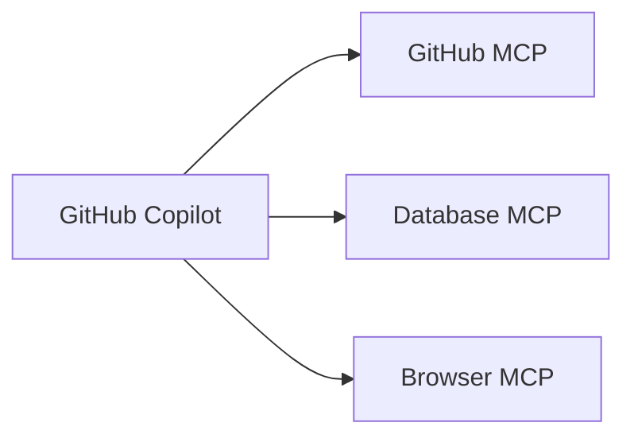

Autor: Alan Sastre

GitHub: [github.com/alansastre/genai-asistentes-codigo](https://github.com/alansastre/genai-asistentes-codigo)

**Model Context Protocol (MCP)** es un estándar abierto que permite a los modelos de IA interactuar con herramientas y servicios externos. En VS Code, los servidores MCP extienden las capacidades de GitHub Copilot permitiéndole acceder a bases de datos, APIs, navegadores y otros servicios.

## Qué es MCP

MCP define un protocolo de comunicación entre clientes de IA (como GitHub Copilot) y servidores que proporcionan **herramientas** adicionales. Cuando instalas un servidor MCP, sus herramientas quedan disponibles en el modo Agent para que Copilot las invoque automáticamente según el contexto.



Por ejemplo, con el servidor MCP de GitHub instalado, puedes pedirle a Copilot que liste tus issues asignados y el agente invocará automáticamente la herramienta correspondiente.

## Instalar servidores MCP

VS Code facilita la instalación de servidores MCP desde el registro de GitHub.

### Desde el registro integrado

La forma más sencilla de instalar servidores MCP:

* Abre la vista de extensiones con `Ctrl+Shift+X`
* Escribe `@mcp` en el campo de búsqueda
* Selecciona un servidor y haz clic en **Install**

Puedes elegir instalar el servidor en tu **perfil de usuario** (disponible en todos los proyectos) o en el **workspace** (solo en el proyecto actual).

> Si no ves los servidores MCP, habilita el registro con la configuración `chat.mcp.gallery.enabled`.

### Configuración manual

Para mayor control, puedes configurar servidores MCP creando un archivo `.vscode/mcp.json`:

```json
{
  "servers": {
    "github": {
      "type": "stdio",
      "command": "npx",
      "args": ["-y", "@modelcontextprotocol/server-github"],
      "env": {
        "GITHUB_TOKEN": "${input:github-token}"
      }
    }
  },
  "inputs": [
    {
      "type": "promptString",
      "id": "github-token",
      "description": "GitHub Personal Access Token",
      "password": true
    }
  ]
}
```

La sección **inputs** permite solicitar credenciales de forma segura sin almacenarlas en el código.

## Usar herramientas MCP

Una vez instalado un servidor MCP, sus herramientas están disponibles en el chat.

### Invocación automática

En **Agent Mode**, las herramientas se invocan automáticamente según el contexto:

```plaintext .noeval
Lista mis issues de GitHub asignados
```

El agente detecta que necesita la herramienta de GitHub y la invoca para obtener la información.

### Gestionar herramientas activas

Para controlar qué herramientas puede usar el agente:

* Abre el Chat View
* Haz clic en el botón **Tools** (icono de herramientas)
* Activa o desactiva herramientas individuales

> Limita las herramientas activas a las necesarias. Menos herramientas mejoran la precisión de las respuestas.

## Aprobación y seguridad

Las herramientas MCP requieren **aprobación** antes de ejecutarse. Cuando una herramienta va a invocarse, aparece un diálogo de confirmación con opciones:

| Opción | Descripción |
|--------|-------------|
| **Allow Once** | Permite solo esta vez |
| **Allow for Session** | Permite durante la sesión |
| **Allow for Workspace** | Permite siempre en este proyecto |
| **Always Allow** | Permite en cualquier proyecto |

### Buenas prácticas

* Instala solo servidores de fuentes confiables
* Usa **inputs** para tokens y contraseñas
* Revisa la configuración antes de ejecutar un servidor nuevo

## Servidores MCP populares

Estos son algunos de los servidores MCP más utilizados, disponibles desde el registro de GitHub.

### GitHub MCP

Permite consultar y gestionar repositorios, issues y pull requests. Ideal para tareas de mantenimiento desde el chat.

```plaintext .noeval
Lista mis issues asignados en el repositorio actual
```

### Context7

Aporta documentación actualizada de librerías, mejorando la precisión de respuestas técnicas sobre APIs.

### Playwright MCP

Permite automatizar el navegador para pruebas funcionales y validaciones de UI.

```plaintext .noeval
Navega a la pagina de login y comprueba que el boton Entrar esta habilitado
```

### Markitdown MCP

Transforma documentos PDF o Word en Markdown para que Copilot pueda leerlos y resumirlos.

## Gestión de servidores

VS Code proporciona comandos para gestionar los servidores instalados:

| Comando | Descripción |
|---------|-------------|
| **MCP: List Servers** | Lista servidores configurados |
| **MCP: Browse Servers** | Explora el registro |
| **MCP: Reset Trust** | Reinicia la configuración de confianza |

Para cada servidor puedes usar las acciones **Start**, **Stop**, **Restart** y **Show Output** desde el menú contextual o los code lenses en el archivo `mcp.json`.

## Resolución de problemas

Cuando un servidor MCP falla, VS Code muestra un indicador de error. Para ver los logs:

* Haz clic en la notificación de error y selecciona **Show Output**
* O ejecuta **MCP: List Servers** y elige **Show Output** en el servidor

> Si tienes problemas con las herramientas, ejecuta **MCP: Reset Cached Tools** para limpiar la caché.

