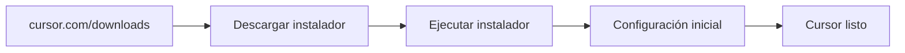
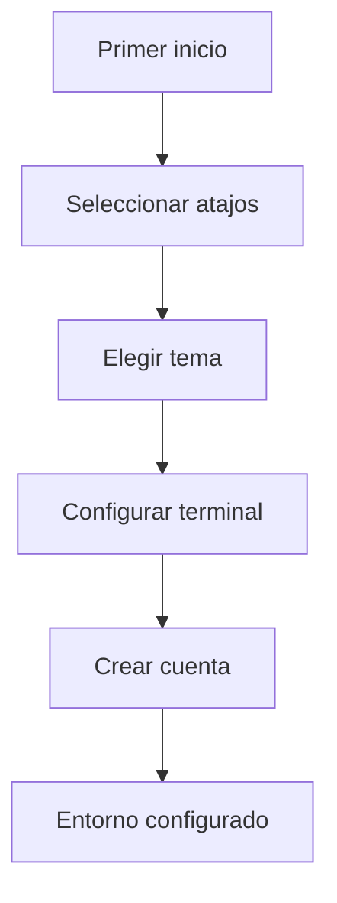

Autor: Alan Sastre

GitHub: [github.com/alansastre/genai-asistentes-codigo](https://github.com/alansastre/genai-asistentes-codigo)

**Cursor AI** es un IDE con inteligencia artificial nativa construido sobre Visual Studio Code. A diferencia de las extensiones que añaden IA a un editor existente, Cursor integra el modelo de IA en cada aspecto de la experiencia de desarrollo, ofreciendo autocompletado avanzado, chat contextual y modo agente desde su núcleo. Esta lección cubre la instalación desde cero y la configuración inicial para comenzar a trabajar.

## Requisitos del sistema

Antes de instalar Cursor AI, es necesario verificar que el equipo cumple con los **requisitos mínimos** para un funcionamiento óptimo.

| Componente | Requisito mínimo | Recomendado |
|------------|------------------|-------------|
| Sistema operativo | Windows 10 (64-bit), macOS 10.15, Ubuntu 18.04 | Versiones actualizadas |
| RAM | 8 GB | 16 GB |
| Almacenamiento | 1 GB libre | 2 GB libre |
| Red | Conexión estable a internet | Banda ancha |

Cursor requiere **conexión a internet** para las funcionalidades de IA, ya que los modelos se ejecutan en servidores remotos. Sin conexión, el editor funciona como un VS Code estándar, pero las sugerencias de código, el chat y el modo agente no estarán disponibles.

> Al estar basado en VS Code, Cursor hereda la compatibilidad con extensiones, configuraciones y atajos de teclado existentes, facilitando la transición desde el editor original.

## Descarga e instalación

El proceso de instalación varía según el sistema operativo. El instalador se obtiene desde la **página oficial** de Cursor.



### Windows

* **1.** Accede a cursor.com/downloads
* **2.** Descarga el archivo `.exe` correspondiente a Windows
* **3.** Ejecuta el instalador y sigue el asistente de instalación
* **4.** Cursor se añade automáticamente al menú de inicio

### macOS

* **1.** Descarga el archivo `.dmg` desde la página oficial
* **2.** Abre el archivo descargado
* **3.** Arrastra el icono de Cursor a la carpeta Aplicaciones
* **4.** La primera vez que abras Cursor, macOS puede solicitar confirmación de seguridad

### Linux

Cursor está disponible en varios formatos para Linux:

* **AppImage**: formato portable que no requiere instalación

```bash .noeval
chmod +x Cursor-*.AppImage
./Cursor-*.AppImage
```

* **Paquete .deb**: para distribuciones basadas en Debian/Ubuntu

```bash .noeval
sudo dpkg -i cursor_*_amd64.deb
sudo apt-get install -f
```

* **Paquete .rpm**: para distribuciones basadas en Fedora/Red Hat

```bash .noeval
sudo rpm -ivh cursor_*_x86_64.rpm
```

## Configuración inicial

Al abrir Cursor por primera vez, aparece un **asistente de configuración** que guía el proceso de personalización del entorno.

### Selección de preferencias

El asistente presenta varias opciones de configuración:

* **Atajos de teclado**: Cursor permite elegir entre el esquema de VS Code (predeterminado) u otros esquemas como Vim o Emacs
* **Tema visual**: selección entre temas claros y oscuros
* **Configuración de terminal**: shell predeterminado y preferencias de integración



### Importación desde VS Code

Si ya tienes VS Code instalado, Cursor ofrece la opción de **importar configuraciones** existentes:

* Extensiones instaladas
* Configuración de usuario (settings.json)
* Atajos de teclado personalizados
* Snippets y fragmentos de código

Esta importación permite comenzar a trabajar inmediatamente con el mismo entorno al que estás acostumbrado, añadiendo las capacidades de IA de Cursor.

> La importación es opcional. Puedes configurar Cursor desde cero si prefieres un entorno limpio sin herencia de configuraciones previas.

## Creación de cuenta

Para acceder a las funcionalidades de IA, es necesario **crear una cuenta** en Cursor. El proceso se realiza directamente desde el editor:

* **1.** Cursor muestra un diálogo de inicio de sesión tras la configuración inicial
* **2.** Selecciona la opción de crear cuenta nueva o usa una cuenta existente
* **3.** Puedes registrarte con correo electrónico o mediante autenticación con GitHub o Google
* **4.** Confirma el correo electrónico si te registras con email

La cuenta permite sincronizar configuraciones entre dispositivos y gestionar la suscripción.

## Planes disponibles

Cursor ofrece diferentes planes con distintos niveles de acceso a las funcionalidades de IA:

| Plan | Precio | Características principales |
|------|--------|----------------------------|
| **Hobby** | Gratis | Prueba de 7 días Pro, límite de peticiones al agente |
| **Pro** | 20 USD/mes | Agente con límites extendidos, Tab ilimitado, agentes en segundo plano |
| **Pro+** | 60 USD/mes | 3x de uso en modelos OpenAI, Claude y Gemini |
| **Ultra** | 200 USD/mes | 20x de uso, acceso prioritario a nuevas funciones |

El plan **Hobby gratuito** incluye una prueba de todas las funcionalidades Pro durante una semana, permitiendo evaluar el potencial completo de la herramienta antes de decidir sobre la suscripción.

> Los límites del plan gratuito se reinician mensualmente. Para proyectos personales o experimentación, el plan Hobby suele ser suficiente.

### Gestión de la suscripción

La suscripción se gestiona desde el **panel de cuenta** en la aplicación:

* **1.** Abre la paleta de comandos con `Ctrl+Shift+P` (Windows/Linux) o `Cmd+Shift+P` (macOS)
* **2.** Busca "Account" o "Cursor Settings"
* **3.** Accede a la sección de suscripción para ver el estado actual o cambiar de plan

## Verificación de la instalación

Para confirmar que Cursor funciona correctamente:

* **1.** Crea un nuevo archivo con extensión `.py`, `.js` o `.ts`
* **2.** Escribe un comentario describiendo una función:

```python .noeval
# función que calcula el área de un círculo dado su radio
```

* **3.** Pulsa Enter y espera unos segundos
* **4.** Cursor debería mostrar una sugerencia en texto atenuado (ghost text)
* **5.** Pulsa `Tab` para aceptar la sugerencia

Si las sugerencias aparecen, la instalación es correcta. En caso contrario:

* Verifica la conexión a internet
* Comprueba que has iniciado sesión en tu cuenta de Cursor
* Revisa que no has alcanzado el límite de tu plan

## Atajos de teclado esenciales

Cursor hereda los atajos de VS Code y añade algunos específicos para sus funcionalidades de IA:

| Acción | Windows/Linux | macOS |
|--------|---------------|-------|
| Aceptar sugerencia | `Tab` | `Tab` |
| Rechazar sugerencia | `Esc` | `Esc` |
| Abrir Chat | `Ctrl+L` | `Cmd+L` |
| Abrir Composer (Agente) | `Ctrl+I` | `Cmd+I` |
| Paleta de comandos | `Ctrl+Shift+P` | `Cmd+Shift+P` |
| Configuración de atajos | `Ctrl+K Ctrl+S` | `Cmd+K Cmd+S` |

Todos los atajos son **personalizables** desde la configuración de teclado. Para acceder:

* **1.** Abre la paleta de comandos
* **2.** Busca "Keyboard Shortcuts"
* **3.** Modifica o añade los atajos según tus preferencias

> Los atajos de Cursor se pueden remapear completamente, incluyendo las funcionalidades específicas de IA como Tab, Chat y Composer.
