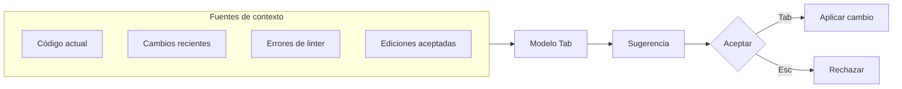
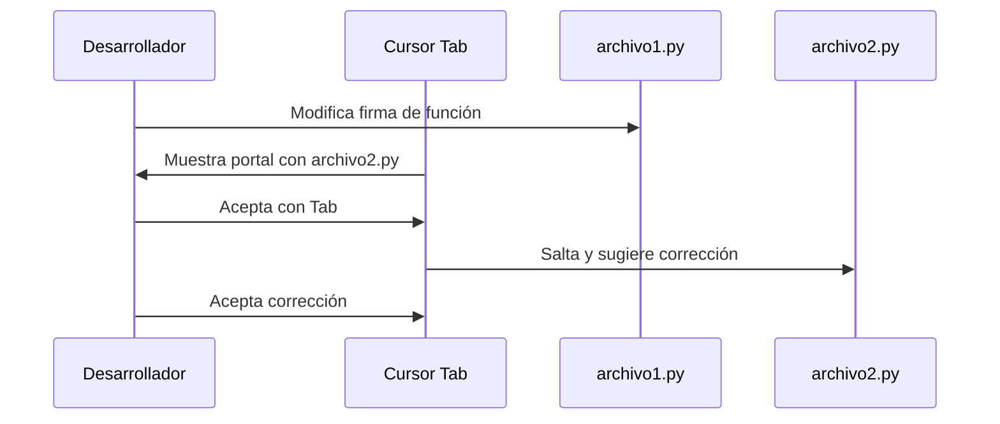

Autor: Alan Sastre

GitHub: [github.com/alansastre/genai-asistentes-codigo](https://github.com/alansastre/genai-asistentes-codigo)

**Cursor Tab** es el sistema de autocompletado predictivo de Cursor AI. A diferencia del autocompletado tradicional que solo sugiere palabras o funciones individuales, Tab utiliza un modelo especializado para predecir ediciones multilínea, corregir errores automáticamente y anticipar la siguiente ubicación donde necesitarás editar. Cuanto más lo usas, mejor se adapta a tu estilo al aprender de las sugerencias que aceptas con `Tab` o rechazas con `Esc`.

## Cómo funciona Tab

El autocompletado de Cursor analiza múltiples fuentes de contexto para generar sugerencias inteligentes:

* **Código circundante**: examina las líneas anteriores y posteriores al cursor
* **Cambios recientes**: tiene en cuenta las modificaciones que acabas de realizar
* **Errores del linter**: detecta problemas de sintaxis o tipos y sugiere correcciones
* **Ediciones aceptadas**: aprende de las sugerencias que has aceptado previamente



## Tipos de sugerencias

Cursor Tab presenta las sugerencias de dos formas distintas según el tipo de modificación propuesta.

### Ghost text para inserciones

Cuando Tab sugiere **código nuevo**, este aparece como texto semitransparente (ghost text) junto al cursor. El texto gris muestra exactamente lo que se insertará si aceptas la sugerencia.

```python .noeval
# Escribes el inicio de una función
def calcular_area_circulo(radio):
    # Tab sugiere en gris: return 3.14159 * radio ** 2
```

Este tipo de sugerencia es habitual cuando:

* Escribes el nombre de una función y Tab completa los parámetros
* Inicias una estructura de control y Tab añade el cuerpo
* Defines una variable y Tab sugiere su valor basándose en el contexto

### Diff popup para modificaciones

Cuando Tab propone **modificar código existente**, aparece un popup a la derecha de la línea actual que muestra las diferencias entre el código actual y la versión sugerida. Este formato permite visualizar exactamente qué cambiará antes de aceptar.

Las modificaciones sugeridas incluyen:

* Corrección de errores detectados por el linter
* Refactorización de código basada en cambios recientes
* Actualización de llamadas a funciones tras modificar su firma

## Interacción con sugerencias

Cursor ofrece varias formas de interactuar con las sugerencias de Tab:

| Acción | Atajo Windows/Linux | Atajo macOS |
|--------|---------------------|-------------|
| Aceptar sugerencia completa | `Tab` | `Tab` |
| Rechazar sugerencia | `Esc` | `Esc` |
| Aceptar siguiente palabra | `Ctrl+Right` | `Cmd+Right` |

### Aceptación parcial

La función de **aceptación parcial** (Partial Accepts) permite incorporar solo parte de una sugerencia palabra por palabra. Esto resulta útil cuando Tab genera una sugerencia correcta pero más extensa de lo necesario.

```python .noeval
# Tab sugiere: resultado = calcular_total(items, descuento, impuestos)
# Pulsando Ctrl/Cmd+Right varias veces, aceptas palabra por palabra:
# resultado -> = -> calcular_total -> ...
```

Para habilitar esta función, accede a `Cursor Settings` > `Tab` y activa la opción **Partial Accepts**.

## Predicción de navegación

Una característica distintiva de Cursor Tab es la **predicción de ubicación**. Tras aceptar una edición, el modelo predice dónde necesitarás editar a continuación y te ofrece saltar directamente a esa posición pulsando `Tab` de nuevo.

### Salto dentro del archivo

Tab predice la siguiente ubicación de edición dentro del mismo archivo. Tras aceptar un cambio, pulsa `Tab` nuevamente para saltar a la siguiente posición sugerida.

```python .noeval
# 1. Modificas la firma de una función añadiendo un parámetro
def procesar_datos(datos, formato, validar=True):  # Añades 'validar'
    pass

# 2. Tab sugiere saltar a la primera llamada de la función
procesar_datos(mis_datos, "json")  # Tab sugiere añadir: , validar=True

# 3. Aceptas y Tab salta a la siguiente llamada
procesar_datos(otros_datos, "csv")  # Tab sugiere lo mismo
```

### Salto entre archivos

Tab también puede predecir ediciones necesarias en **otros archivos**. Cuando detecta que un cambio afecta a otro archivo, aparece una ventana portal en la parte inferior del editor mostrando la ubicación sugerida.



Esta funcionalidad es especialmente útil en refactorizaciones que afectan a múltiples archivos del proyecto.

## Auto-import

En **Python** y **TypeScript**, Tab detecta automáticamente cuando utilizas un símbolo que no está importado y sugiere añadir el import correspondiente.

```python .noeval
# Escribes código que usa pandas sin importarlo
df = pd.read_csv("datos.csv")

# Tab detecta que 'pd' no está definido y sugiere añadir:
import pandas as pd
```

Al aceptar la sugerencia, Tab añade el import en la parte superior del archivo sin interrumpir tu flujo de trabajo.

Si el auto-import no funciona correctamente:

* Verifica que tu proyecto tiene el language server configurado (Pylance para Python)
* Comprueba que el import aparece en las sugerencias de Quick Fix (`Ctrl+.` o `Cmd+.`)

## Tab en vistas Peek

Cursor Tab funciona dentro de las **vistas Peek** de VS Code, como "Go to Definition" (`F12`) o "Go to Type Definition". Esta integración permite:

* Modificar una definición de función directamente en el Peek
* Ver las sugerencias de Tab para actualizar cada uso
* Aceptar los cambios sin salir de la vista Peek

```python .noeval
# 1. Usas Ctrl+Click o F12 sobre una función para abrir Peek
# 2. Modificas la firma añadiendo un parámetro
# 3. Tab sugiere actualizaciones en cada llamada visible
# 4. Aceptas con Tab y saltas a la siguiente
```

Para usuarios de Vim, el comando `gd` (go to definition) combinado con Tab en Peek views permite refactorizar funciones y actualizar todos sus usos en un flujo continuo.

## Configuración de Tab

Las opciones de configuración de Tab se encuentran en `Cursor Settings` > `Tab`:

| Opción | Descripción |
|--------|-------------|
| Cursor Tab | Activa o desactiva el autocompletado predictivo |
| Partial Accepts | Habilita la aceptación palabra por palabra con `Ctrl/Cmd+Right` |
| Suggestions While Commenting | Permite sugerencias dentro de bloques de comentarios |
| Whitespace-Only Suggestions | Permite ediciones que solo afectan al formato |
| Imports | Habilita auto-import para TypeScript |
| Auto Import for Python (beta) | Habilita auto-import para proyectos Python |

### Control desde la barra de estado

La barra de estado (parte inferior derecha) permite controlar Tab rápidamente:

* **Snooze**: Desactiva Tab temporalmente durante un tiempo elegido
* **Disable globally**: Desactiva Tab para todos los archivos
* **Disable for extensions**: Desactiva Tab para extensiones específicas (por ejemplo, markdown o JSON)

Esta última opción es útil si Tab interfiere al escribir documentación o archivos de configuración.

## Diferencias con autocompletado tradicional

Tab se diferencia del autocompletado de VS Code o GitHub Copilot en varios aspectos:

| Aspecto | Autocompletado tradicional | Cursor Tab |
|---------|---------------------------|------------|
| Alcance | Línea actual | Multilínea |
| Contexto | Archivo abierto | Cambios recientes + linter + ediciones aceptadas |
| Navegación | Manual | Predicción automática dentro y entre archivos |
| Aprendizaje | Estático | Se adapta según aceptas o rechazas sugerencias |

El modelo de Tab está **entrenado específicamente** para tareas de edición de código, no solo para generación. Esta especialización le permite entender patrones de modificación y predecir secuencias de cambios relacionados con mayor precisión que modelos de propósito general.
