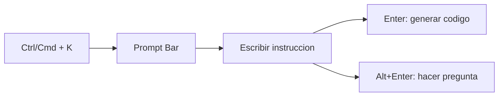
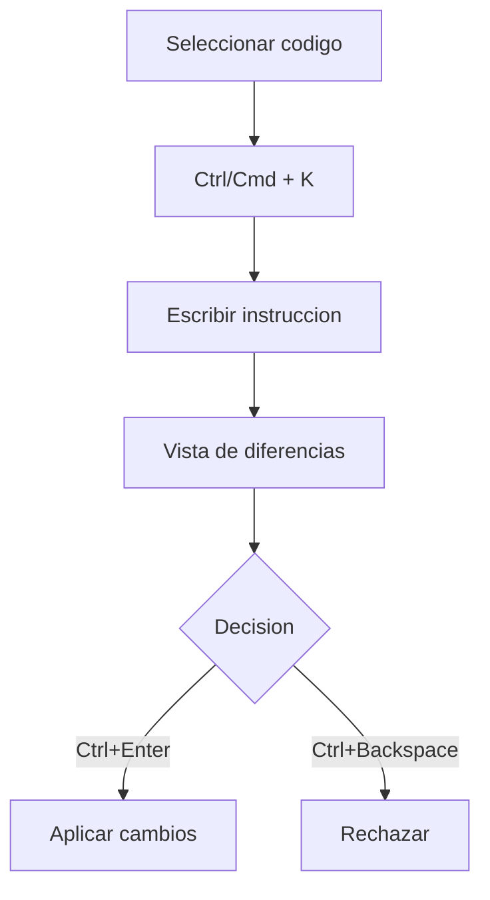
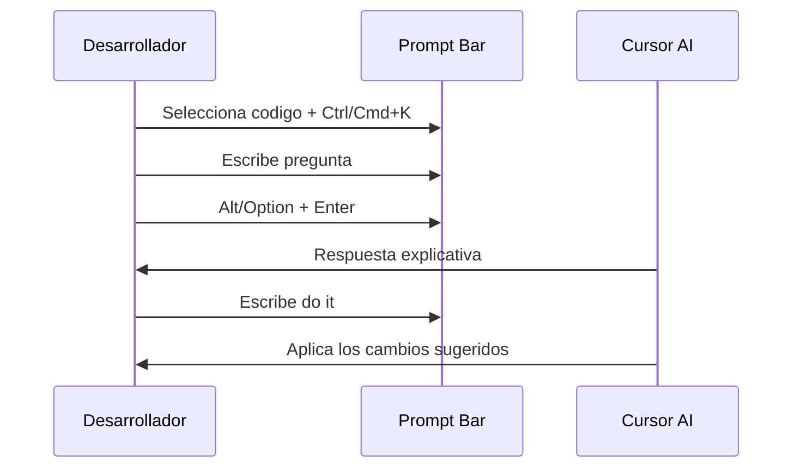
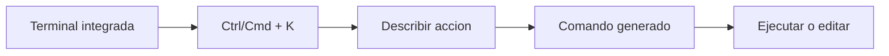

Autor: Alan Sastre

GitHub: [github.com/alansastre/genai-asistentes-codigo](https://github.com/alansastre/genai-asistentes-codigo)

**Inline Edit** permite editar o generar código mediante instrucciones en lenguaje natural directamente en el editor. A diferencia de Tab, que sugiere cambios automáticamente mientras escribes, Inline Edit responde a **peticiones explícitas** del desarrollador a través de una barra de prompts. Esta característica funciona tanto en archivos de código como en la terminal integrada.

## El Prompt Bar

El **Prompt Bar** es la interfaz principal de Inline Edit. Se activa con `Ctrl+K` (Windows/Linux) o `Cmd+K` (macOS) y aparece como una barra de entrada flotante junto al cursor o sobre el código seleccionado.



El Prompt Bar acepta instrucciones en **lenguaje natural** describiendo qué código necesitas o qué cambios quieres aplicar. Cursor interpreta la instrucción, analiza el contexto del archivo y genera o modifica el código correspondiente.

> Cursor incluye automáticamente **contexto relevante** como archivos relacionados, código recientemente visitado y la estructura del proyecto para mejorar la precisión de las respuestas.

## Modos de uso en archivos

Inline Edit opera en diferentes modos según la selección de código y el atajo utilizado.

### Generación de código

Sin seleccionar código, el Prompt Bar genera **código nuevo** en la posición actual del cursor. Cursor incluye el código circundante como contexto, por ejemplo, si el cursor está sobre el nombre de una función, incluirá la función completa.

Casos de uso habituales:

* Crear funciones completas a partir de una descripción
* Añadir imports o dependencias
* Insertar clases o estructuras de datos

```python .noeval
# Posicionas el cursor donde quieres el código
# Pulsas Ctrl/Cmd + K
# Escribes: "clase para representar un producto con nombre, precio y stock"

class Producto:
    def __init__(self, nombre: str, precio: float, stock: int):
        self.nombre = nombre
        self.precio = precio
        self.stock = stock
    
    def disponible(self) -> bool:
        return self.stock > 0
    
    def aplicar_descuento(self, porcentaje: float) -> float:
        return self.precio * (1 - porcentaje / 100)
```

La generación considera el **contexto del archivo** actual, incluyendo imports existentes, convenciones de nombrado y patrones utilizados en el código circundante.

### Edición de código seleccionado

Cuando seleccionas código antes de pulsar `Ctrl+K`, el Prompt Bar entra en **modo edición**. Las instrucciones que escribas se aplicarán al fragmento seleccionado.



Ejemplos de instrucciones de edición:

* "convierte a async/await"
* "añade manejo de errores con try/except"
* "optimiza este bucle usando list comprehension"
* "añade type hints"
* "refactoriza usando el patrón factory"

Los cambios propuestos aparecen en una **vista de diferencias** que muestra el código original y el modificado, permitiendo revisar antes de aceptar.

```python .noeval
# Código original seleccionado:
def procesar_datos(datos):
    resultado = []
    for item in datos:
        if item > 0:
            resultado.append(item * 2)
    return resultado

# Instrucción: "optimiza usando list comprehension"
# Resultado propuesto:
def procesar_datos(datos):
    return [item * 2 for item in datos if item > 0]
```

### Edición de archivo completo

Para cambios que afectan a **múltiples secciones** de un archivo, Inline Edit ofrece el modo de archivo completo con `Ctrl+Shift+Enter` (Windows/Linux) o `Cmd+Shift+Enter` (macOS).

Este modo analiza todo el archivo y aplica cambios coordinados en diferentes ubicaciones:

* Renombrar una variable en todas sus apariciones
* Añadir un parámetro a una función y actualizar sus llamadas
* Cambiar el estilo de imports en todo el archivo
* Aplicar un patrón de refactorización global

```python .noeval
# Instrucción: "añade logging a todas las funciones del archivo"
# Cursor modifica múltiples funciones coordinadamente, añadiendo:
import logging

logger = logging.getLogger(__name__)

def calcular_total(items):
    logger.info(f"Calculando total para {len(items)} items")
    # resto del código...

def procesar_pedido(pedido):
    logger.info(f"Procesando pedido {pedido.id}")
    # resto del código...
```

## Flujo de trabajo e instrucciones de seguimiento

La interacción con Inline Edit sigue un **patrón iterativo** que permite refinar los resultados.

| Acción | Atajo Windows/Linux | Atajo macOS |
|--------|---------------------|-------------|
| Abrir Prompt Bar | `Ctrl+K` | `Cmd+K` |
| Ejecutar prompt | `Enter` | `Enter` |
| Hacer pregunta | `Alt+Enter` | `Option+Enter` |
| Aceptar cambios | `Ctrl+Enter` | `Cmd+Enter` |
| Rechazar cambios | `Ctrl+Backspace` | `Cmd+Backspace` |
| Edición de archivo completo | `Ctrl+Shift+Enter` | `Cmd+Shift+Enter` |
| Enviar a Chat | `Ctrl+L` | `Cmd+L` |

Tras una generación o edición, puedes **refinar el resultado** sin cerrar el Prompt Bar. Escribe instrucciones adicionales y pulsa Enter para que la IA actualice los cambios basándose en tu feedback.

```python .noeval
# Primera instrucción: "función para validar emails"
def validar_email(email: str) -> bool:
    import re
    patron = r'^[a-zA-Z0-9._%+-]+@[a-zA-Z0-9.-]+\.[a-zA-Z]{2,}$'
    return bool(re.match(patron, email))

# Seguimiento: "añade validación de dominios permitidos"
def validar_email(email: str, dominios_permitidos: list[str] = None) -> bool:
    import re
    patron = r'^[a-zA-Z0-9._%+-]+@[a-zA-Z0-9.-]+\.[a-zA-Z]{2,}$'
    if not re.match(patron, email):
        return False
    if dominios_permitidos:
        dominio = email.split('@')[1]
        return dominio in dominios_permitidos
    return True
```

Este flujo iterativo permite construir código complejo paso a paso, validando cada cambio antes de continuar.

## Quick Question

La función **Quick Question** permite hacer preguntas sobre el código sin modificarlo. Se activa pulsando `Alt+Enter` (Windows/Linux) o `Option+Enter` (macOS) en lugar de Enter.



Quick Question es útil para:

* Entender qué hace un fragmento de código
* Pedir explicación de un algoritmo antes de modificarlo
* Consultar alternativas de implementación

Tras recibir la respuesta, puedes escribir **"do it"** en el Prompt Bar para que Cursor aplique los cambios que describió en su explicación. Esto permite explorar ideas antes de implementarlas.

> Quick Question mantiene el código sin modificar hasta que explícitamente pides aplicar cambios. Esto permite explorar opciones antes de comprometerte con una solución.

## Inline Edit en terminal

Inline Edit también funciona en la **terminal integrada** de Cursor. Al pulsar `Ctrl+K` o `Cmd+K` dentro de la terminal, aparece un Prompt Bar en la parte inferior donde puedes describir qué comando necesitas ejecutar.



En lugar de recordar la sintaxis exacta de comandos complejos, describes lo que quieres hacer en **lenguaje natural**:

* "crear un entorno virtual de Python"
* "instalar pandas, numpy y matplotlib"
* "buscar archivos .py modificados en los últimos 7 días"
* "comprimir la carpeta src en un archivo zip"

Cursor genera el comando correspondiente basándose en:

* Tu **historial reciente** de terminal
* Las instrucciones del prompt
* El **contexto del proyecto** actual

```bash .noeval 
# Describes: "crear entorno virtual e instalar dependencias del requirements.txt"
# Cursor genera:
python -m venv .venv && source .venv/bin/activate && pip install -r requirements.txt

# Describes: "ejecutar tests con cobertura y generar reporte HTML"
# Cursor genera:
pytest --cov=src --cov-report=html tests/
```

> La generación de comandos en terminal considera el sistema operativo actual, adaptando la sintaxis automáticamente entre Windows, Linux y macOS.

Esta funcionalidad es especialmente útil para comandos que usas con poca frecuencia o que tienen múltiples opciones difíciles de recordar, como operaciones de Git, Docker o herramientas de build.

## Cuándo usar Inline Edit vs Chat

Inline Edit y Chat son **complementarios** pero sirven propósitos diferentes:

| Escenario | Herramienta recomendada |
|-----------|------------------------|
| Edición rápida de un fragmento | Inline Edit |
| Generación de código corto | Inline Edit |
| Generación de comandos de terminal | Inline Edit en terminal |
| Cambios en múltiples archivos | Chat |
| Exploración y conversación extensa | Chat |
| Refactorización compleja con contexto amplio | Chat |
| Preguntas rápidas sobre código seleccionado | Inline Edit (Quick Question) |

Para enviar código al Chat desde Inline Edit, selecciona el código y pulsa `Ctrl+L` (Windows/Linux) o `Cmd+L` (macOS). Esto transfiere el fragmento al panel de Chat donde puedes mantener una conversación más extensa o solicitar ediciones en múltiples archivos.
