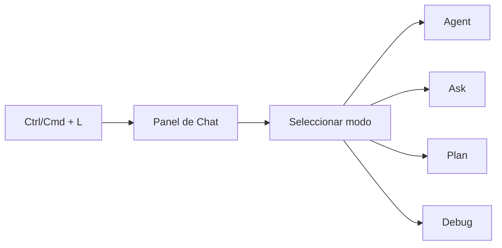
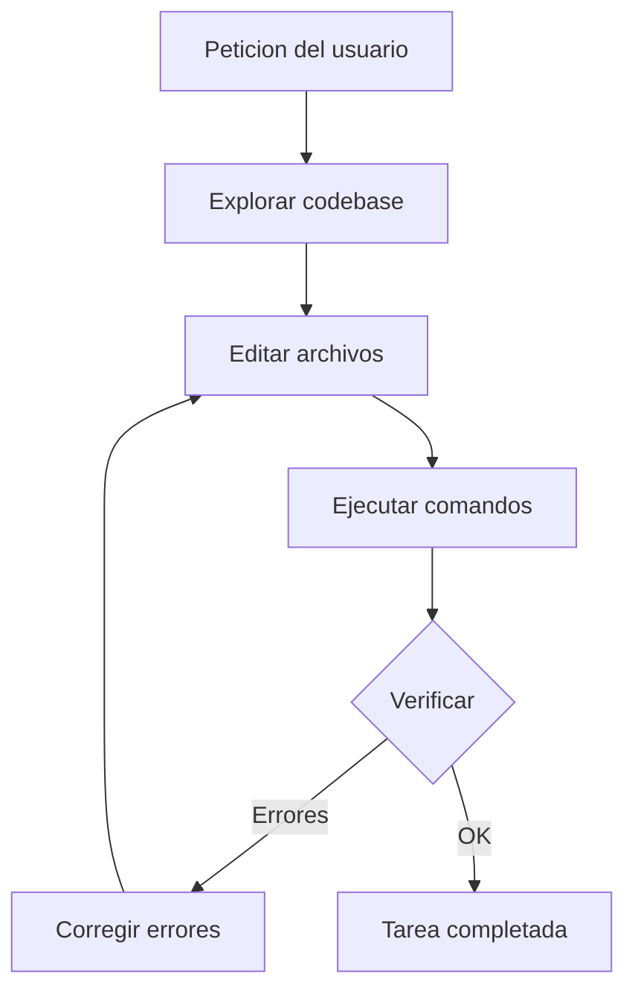
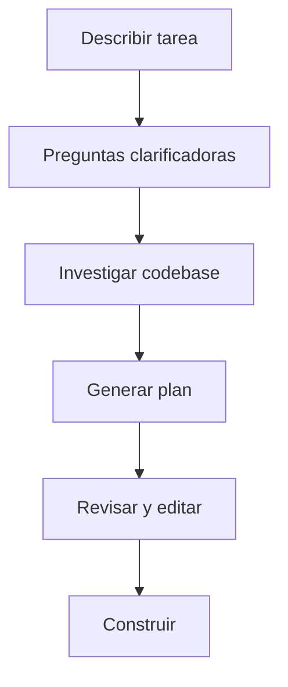
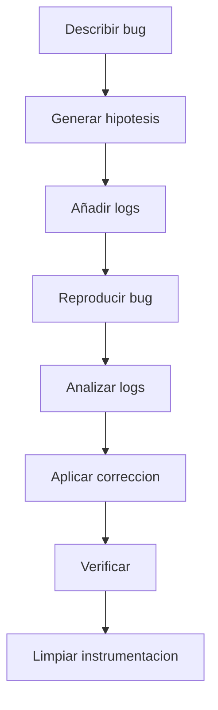

Autor: Alan Sastre

GitHub: [github.com/alansastre/genai-asistentes-codigo](https://github.com/alansastre/genai-asistentes-codigo)

El panel de **Chat** de Cursor ofrece diferentes modos de interacción adaptados a distintos tipos de tareas. Cada modo configura las **herramientas disponibles** y el comportamiento de la IA de forma diferente: desde responder preguntas sin modificar código hasta ejecutar cambios autónomos en múltiples archivos.

## Acceso y navegación entre modos

El panel de Chat se abre con `Ctrl+L` (Windows/Linux) o `Cmd+L` (macOS). Este atajo también enfoca el campo de entrada si el panel ya está abierto.



Para cambiar entre modos:

* **Selector desplegable**: en la parte superior del panel de Chat
* **Atajo rápido**: `Ctrl+.` o `Cmd+.` para cambio rápido
* **Shift+Tab**: rota directamente a Plan Mode desde el campo de entrada

| Modo | Para | Herramientas |
|------|------|--------------|
| Agent | Features complejas, refactorización | Todas habilitadas |
| Ask | Aprendizaje, preguntas, planificación | Solo herramientas de búsqueda |
| Plan | Features complejas que requieren planificación | Todas habilitadas |
| Debug | Bugs difíciles, regresiones | Todas + servidor de debug |

> El historial de conversaciones se mantiene al cambiar de modo, permitiendo alternar entre exploración (Ask) y ejecución (Agent) sin perder contexto.

## Agent Mode

El modo **Agent** es el modo por defecto para tareas de desarrollo. La IA actúa de forma **autónoma**, explorando el código base, editando múltiples archivos, ejecutando comandos en terminal y corrigiendo errores de forma iterativa.



### Capacidades del Agent

El modo Agent tiene acceso a **todas las herramientas**:

* **Leer y editar archivos**: acceso completo al sistema de archivos del proyecto
* **Ejecutar terminal**: correr comandos como tests, builds o instalación de dependencias
* **Detectar errores de linter**: leer diagnósticos y aplicar correcciones automáticas
* **Iterar automáticamente**: si un cambio genera errores, intentar corregirlos

Ejemplo de prompt para crear una API REST con FastAPI:

```plaintext .noeval
Crea una API REST con FastAPI que tenga un endpoint GET /saludo que devuelva un mensaje de bienvenida
```

El Agent genera el código, crea los archivos necesarios y puede ejecutar la aplicación:

```python .noeval
from fastapi import FastAPI

app = FastAPI()

@app.get("/saludo")
def obtener_saludo():
    return {"mensaje": "Hola mundo desde FastAPI"}
```

Para ejecutar la API, el Agent puede correr automáticamente:

```bash .noeval
uvicorn main:app --reload
```

### Niveles de autonomía

El comportamiento del Agent respecto a comandos de terminal se configura en Cursor Settings > Features > Agent:

| Nivel | Comportamiento |
|-------|----------------|
| Confirmar siempre | Pide aprobación antes de cada comando |
| Auto-ejecutar seguros | Ejecuta comandos de lectura, pide confirmación para escritura |
| Yolo Mode | Ejecuta todos los comandos automáticamente |

> Yolo Mode acelera el desarrollo pero requiere precaución. Configura listas de comandos permitidos o denegados para evitar ejecuciones no deseadas.

## Ask Mode

El modo **Ask** es un modo de **solo lectura** diseñado para exploración y aprendizaje. La IA busca en el código base y responde preguntas, pero **no realiza cambios** ni ejecuta comandos.

| Característica | Descripción |
|----------------|-------------|
| Modificación de archivos | No |
| Ejecución de comandos | No |
| Herramientas | Solo búsqueda (leer archivos, grep, búsqueda semántica) |

Ask Mode es útil para:

* Entender qué hace una función o módulo
* Pedir explicaciones de patrones o arquitecturas
* Explorar opciones de implementación antes de decidir
* Obtener información sobre librerías antes de usarlas

```plaintext .noeval
Explica cómo funciona el decorador @app.get de FastAPI y qué parámetros acepta
```

La IA analiza la documentación y el código base para generar respuestas explicativas con ejemplos:

```python .noeval
# El decorador @app.get define un endpoint HTTP GET
# Acepta parámetros como path, response_model, status_code, etc.

@app.get("/usuarios/{usuario_id}", response_model=Usuario, status_code=200)
def obtener_usuario(usuario_id: int):
    # FastAPI valida automáticamente el tipo del parámetro
    return {"id": usuario_id, "nombre": "Ejemplo"}
```

> Ask Mode es el punto de partida recomendado cuando trabajas con código desconocido. Primero entiende, luego modifica con Agent.

## Plan Mode

El modo **Plan** crea **planes de implementación detallados** antes de escribir código. El Agent investiga el código base, hace preguntas clarificadoras y genera un plan revisable que puedes editar antes de ejecutar.



### Flujo de trabajo

* **1.** El Agent hace preguntas clarificadoras para entender los requisitos
* **2.** Investiga el código base para recopilar contexto relevante
* **3.** Crea un plan de implementación comprensivo
* **4.** Revisas y editas el plan a través del chat o archivos markdown
* **5.** Haces clic en "Build" cuando el plan está listo

Ejemplo de prompt para planificar una feature:

```plaintext .noeval
Planifica cómo añadir autenticación JWT a esta API de FastAPI
```

El plan generado incluye pasos ordenados, archivos a modificar y consideraciones:

```markdown .noeval
## Plan: Autenticación JWT para FastAPI

### Paso 1: Instalar dependencias
- python-jose para manejo de tokens JWT
- passlib para hashing de contraseñas

### Paso 2: Crear modelo de Usuario
- Archivo: models/usuario.py
- Campos: id, email, password_hash

### Paso 3: Implementar utilidades de autenticación
- Archivo: auth/jwt.py
- Funciones: crear_token, verificar_token

### Paso 4: Crear endpoints de auth
- POST /auth/registro
- POST /auth/login

### Paso 5: Proteger endpoints existentes
- Añadir dependencia de autenticación a rutas protegidas
```

Los planes se abren como **archivos virtuales efímeros** que puedes ver y editar. Para guardar un plan permanentemente, haz clic en "Save to workspace" y se almacenará en `.cursor/plans/` para referencia futura o documentación.

### Cuándo usar Plan Mode

Plan Mode funciona mejor para:

* Features complejas con **múltiples enfoques válidos**
* Tareas que tocan **muchos archivos o sistemas**
* Requisitos poco claros donde necesitas explorar antes de entender el alcance
* Decisiones arquitectónicas donde quieres revisar el enfoque primero

> Para cambios pequeños o tareas que has hecho muchas veces, ir directamente a Agent Mode es más eficiente.

### Reiniciar desde un plan

Si el Agent construye algo que no coincide con lo esperado, en lugar de intentar arreglarlo con prompts de seguimiento, **vuelve al plan**. Revierte los cambios, refina el plan para que sea más específico y ejecútalo de nuevo. Esto suele ser más rápido y produce resultados más limpios.

## Debug Mode

El modo **Debug** ayuda a encontrar la **causa raíz** de bugs difíciles de reproducir o entender. En lugar de escribir código inmediatamente, el Agent genera hipótesis, añade logs de instrumentación y usa información de runtime para identificar el problema exacto antes de aplicar una corrección dirigida.



### Flujo de trabajo en Debug Mode

* **1. Explorar e hipotetizar**: el Agent explora archivos relevantes y genera múltiples hipótesis sobre posibles causas raíz
* **2. Añadir instrumentación**: inserta logs que envían datos a un servidor de debug local
* **3. Reproducir el bug**: te pide que reproduzcas el bug siguiendo pasos específicos
* **4. Analizar logs**: revisa los logs recopilados para identificar la causa real basándose en evidencia de runtime
* **5. Aplicar corrección dirigida**: hace un fix enfocado que aborda directamente la causa raíz
* **6. Verificar y limpiar**: puedes re-ejecutar los pasos de reproducción y el Agent elimina toda la instrumentación

Ejemplo de prompt para debuggear una API:

```plaintext .noeval
El endpoint POST /usuarios devuelve 500 cuando el email ya existe en lugar de 400
```

El Agent instrumenta el código para capturar el flujo:

```python .noeval
from fastapi import FastAPI, HTTPException
import logging

logger = logging.getLogger("debug")

@app.post("/usuarios")
def crear_usuario(usuario: UsuarioCreate):
    logger.debug(f"Recibido usuario: {usuario.email}")
    
    existente = db.query(Usuario).filter(Usuario.email == usuario.email).first()
    logger.debug(f"Usuario existente: {existente}")
    
    if existente:
        logger.debug("Email duplicado detectado")
        # Bug encontrado: faltaba raise HTTPException
        raise HTTPException(status_code=400, detail="Email ya registrado")
    
    # resto del código...
```

### Cuándo usar Debug Mode

Debug Mode funciona mejor para:

* **Bugs reproducibles pero difíciles de entender**: cuando sabes que algo falla pero la causa no es obvia leyendo el código
* **Race conditions y problemas de timing**: problemas que dependen del orden de ejecución o comportamiento async
* **Problemas de rendimiento y memory leaks**: issues que requieren profiling de runtime
* **Regresiones donde algo funcionaba antes**: cuando necesitas rastrear qué cambió

> Cuando las interacciones estándar con Agent no resuelven un bug, Debug Mode proporciona un enfoque diferente usando evidencia de runtime en lugar de adivinar correcciones.

## Comandos personalizados

Para flujos de trabajo especializados, puedes crear **comandos slash personalizados** que combinan instrucciones específicas con limitaciones de herramientas. Los comandos se almacenan en `.cursor/commands/` y se activan con el prefijo `/`.

Ejemplos de comandos personalizados:

* `/learn`: enfocado en explicar conceptos, limitado a herramientas de búsqueda
* `/refactor`: instrucciones para mejorar estructura sin añadir funcionalidad
* `/test`: especializado en escribir tests para código existente

```plaintext .noeval
# Ejemplo de comando /api en .cursor/commands/api.md
Crea endpoints REST siguiendo las convenciones del proyecto.
Usa FastAPI con validación Pydantic.
Incluye documentación OpenAPI en cada endpoint.
```

> Los comandos personalizados permiten definir workflows reutilizables que se comparten con el equipo a través del repositorio.

## Aplicar código desde Chat

Independientemente del modo, cuando el Chat genera bloques de código puedes aplicarlos al archivo actual:

* **1.** Haz clic en el botón de aplicar en la esquina del bloque de código
* **2.** Revisa los cambios en la vista de diferencias
* **3.** Acepta con `Ctrl+Enter` o rechaza con `Ctrl+Backspace`

Esta funcionalidad permite usar Ask Mode para explorar soluciones y luego aplicar selectivamente los fragmentos de código sugeridos, combinando lo mejor de ambos modos.
