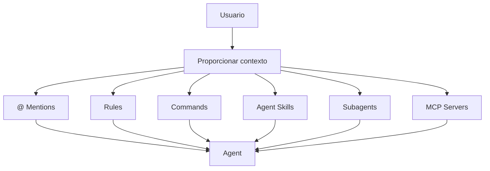
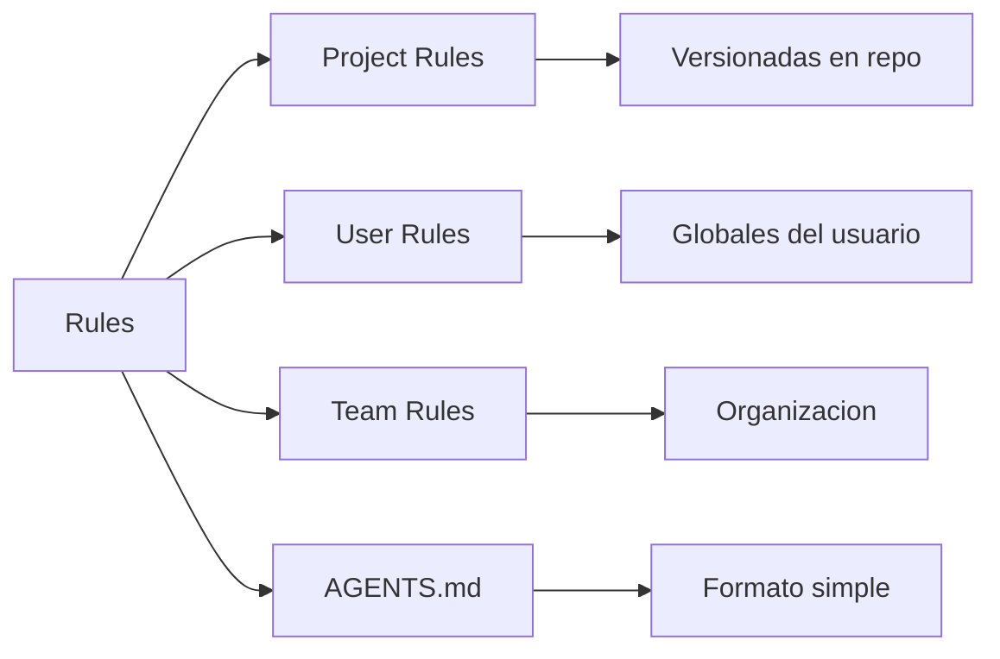
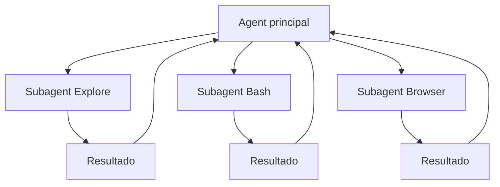

Autor: Alan Sastre

GitHub: [github.com/alansastre/genai-asistentes-codigo](https://github.com/alansastre/genai-asistentes-codigo)

Los modelos de lenguaje no retienen **memoria entre conversaciones**. Cada vez que interactúas con el Agent, este parte de cero sin recordar sesiones anteriores. El **contexto** es la información que proporcionas al modelo para que entienda tu proyecto, convenciones y objetivos.

Cursor ofrece múltiples mecanismos para proporcionar contexto de forma **persistente y reutilizable**: menciones directas, reglas de proyecto, comandos personalizados, skills, subagents y servidores MCP. Dominar estas herramientas permite obtener respuestas más precisas y reducir la necesidad de repetir instrucciones.



## Menciones con @

Las **menciones** permiten referenciar archivos, carpetas, fragmentos de código y documentación directamente en el chat. El símbolo `@` activa un menú de sugerencias que filtra los recursos disponibles.

### Archivos y carpetas

Para incluir un archivo completo como contexto:

* Escribe `@` seguido del nombre del archivo
* Usa `@Files & Folders` para buscar por nombre
* Arrastra archivos desde el explorador al campo de entrada

```plaintext .noeval
@main.py Explica qué hace esta función principal
```

Las carpetas funcionan de manera similar. Cursor proporciona la ruta y una **vista general del contenido**:

```plaintext .noeval
@src/api/ Revisa los endpoints de esta carpeta y sugiere mejoras
```

> Los archivos y carpetas grandes se **condensan automáticamente** para ajustarse a los límites del contexto. Cursor resume el contenido manteniendo la información relevante.

### Fragmentos de código

La mención `@Code` permite referenciar **secciones específicas** en lugar de archivos completos. Resulta más eficiente cuando solo necesitas contexto de una función o clase concreta:

```plaintext .noeval
@Code:Usuario.validar_email Revisa la validación de este método
```

### Documentación externa

Con `@Docs` accedes a documentación de frameworks y librerías populares. Cursor incluye documentación precargada de tecnologías comunes y permite añadir documentación personalizada:

* **1.** Escribe `@Docs` en el chat
* **2.** Selecciona **Add new doc**
* **3.** Pega la URL de la documentación

```plaintext .noeval
@Docs:FastAPI Muestra cómo implementar autenticación OAuth2
```

La documentación añadida se indexa automáticamente, incluyendo todas las subpáginas. Desde **Cursor Settings > Indexing & Docs** puedes gestionar las documentaciones añadidas.

## Rules: instrucciones persistentes

Las **rules** proporcionan instrucciones a nivel de sistema que se incluyen al inicio del contexto del modelo. Persisten entre sesiones y aplican automáticamente según su configuración.



### Project Rules

Las reglas de proyecto se almacenan en `.cursor/rules/` como archivos markdown. Son **versionables** y se comparten con el equipo a través del repositorio.

Cada archivo de regla puede tener **frontmatter** para controlar cuándo se aplica:

```yaml .noeval
---
description: "Convenciones para componentes React"
globs: "**/*.tsx"
alwaysApply: false
---

Usa componentes funcionales con hooks.
Nombra los archivos en PascalCase.
Exporta componentes como default.
```

| Tipo de regla | Comportamiento |
|---------------|----------------|
| Always Apply | Se aplica en toda sesión de chat |
| Apply Intelligently | El Agent decide si es relevante |
| Apply to Specific Files | Aplica cuando coincide el patrón glob |
| Apply Manually | Solo al mencionar con `@nombre-regla` |

Para crear una regla, usa el comando `New Cursor Rule` desde la paleta de comandos o navega a **Cursor Settings > Rules, Commands**.

> Mantén las reglas **bajo 500 líneas** y divídelas en múltiples archivos componibles. Incluye ejemplos concretos y referencia archivos en lugar de copiar código.

### AGENTS.md

El archivo `AGENTS.md` es una alternativa simplificada a las reglas estructuradas. Se coloca en la **raíz del proyecto** y contiene instrucciones en markdown plano:

```markdown .noeval
# Instrucciones del proyecto

## Estilo de código
- Usa TypeScript para archivos nuevos
- Prefiere componentes funcionales en React
- Usa snake_case para columnas de base de datos

## Arquitectura
- Sigue el patrón repositorio
- Mantén la lógica de negocio en servicios
```

Cursor detecta automáticamente `AGENTS.md` en el directorio raíz y subdirectorios. Es compatible con otros editores y agentes que soporten este estándar.

### User Rules

Las **User Rules** son preferencias globales definidas en **Cursor Settings > Rules**. Aplican a **todos los proyectos** y son ideales para configurar estilo de comunicación o convenciones personales:

```plaintext .noeval
Responde de forma concisa. Evita repeticiones innecesarias.
Usa español de España para explicaciones.
```

### Team Rules

Disponibles en planes **Team y Enterprise**, las reglas de equipo se gestionan desde el dashboard de Cursor y aplican automáticamente a todos los miembros. Los administradores pueden marcar reglas como **obligatorias** para que no puedan desactivarse.

El orden de precedencia es: **Team Rules > Project Rules > User Rules**.

## Commands: flujos reutilizables

Los **comandos personalizados** definen flujos de trabajo que se activan con el prefijo `/` en el chat. Se almacenan como archivos markdown en `.cursor/commands/`:

```plaintext .noeval
.cursor/
  commands/
    code-review.md
    create-test.md
    security-audit.md
```

Ejemplo de comando para revisión de código:

```markdown .noeval
Revisa el código seleccionado buscando:
- Posibles bugs o errores lógicos
- Violaciones de las convenciones del proyecto
- Oportunidades de optimización
- Código duplicado

Proporciona sugerencias ordenadas por prioridad.
```

Para usarlo, escribe `/code-review` en el chat. Puedes añadir **parámetros adicionales** después del nombre del comando:

```plaintext .noeval
/code-review enfócate en rendimiento y uso de memoria
```

> Los comandos de equipo se gestionan desde el dashboard y están disponibles automáticamente para todos los miembros sin necesidad de sincronización manual.

## Agent Skills

Los **Agent Skills** son un estándar abierto para extender las capacidades del agente con conocimiento especializado. Un skill es una **carpeta con un archivo SKILL.md** que contiene instrucciones y opcionalmente scripts ejecutables.

```plaintext .noeval
.cursor/
  skills/
    deploy-app/
      SKILL.md
      scripts/
        deploy.sh
        validate.py
```

### Estructura de un skill

El archivo `SKILL.md` define el skill con frontmatter y contenido:

```yaml .noeval
---
name: deploy-app
description: Deploy the application to staging or production. Use when deploying code.
---

# Deploy App

## When to Use
- Usuario solicita despliegue
- Se menciona staging o production

## Instructions
1. Valida el código con `scripts/validate.py`
2. Ejecuta el despliegue con `scripts/deploy.sh <environment>`
```

Los skills se cargan automáticamente desde estas ubicaciones:

| Ubicación | Alcance |
|-----------|---------|
| `.cursor/skills/` | Proyecto |
| `~/.cursor/skills/` | Usuario (global) |

El Agent decide cuándo aplicar un skill basándose en la **descripción**. También puedes invocar skills manualmente con `/nombre-skill` en el chat.

> Los skills pueden incluir directorios `scripts/` para código ejecutable, `references/` para documentación adicional y `assets/` para recursos estáticos.

## Subagents

Los **subagents** son asistentes especializados que el Agent puede delegar para tareas específicas. Cada subagent opera en su **propia ventana de contexto**, lo que permite:

* **Aislamiento de contexto**: tareas largas de investigación no consumen espacio en la conversación principal
* **Ejecución paralela**: múltiples subagents trabajan simultáneamente en diferentes partes del código
* **Especialización**: cada subagent tiene prompts y herramientas optimizadas para su tarea



### Subagents integrados

Cursor incluye tres subagents predefinidos:

| Subagent | Propósito |
|----------|-----------|
| **Explore** | Búsqueda y análisis de código. Usa un modelo más rápido para ejecutar múltiples búsquedas en paralelo |
| **Bash** | Ejecución de comandos de terminal. Aísla la salida verbosa de logs |
| **Browser** | Control del navegador via MCP. Filtra snapshots del DOM y capturas de pantalla |

### Subagents personalizados

Puedes crear subagents propios añadiendo archivos markdown en `.cursor/agents/` o `~/.cursor/agents/`:

```yaml .noeval
---
name: verifier
description: Validates completed work, runs tests, and reports results.
---

# Verifier

## Instructions
1. Check that implementations match requirements
2. Run relevant tests
3. Report what passed vs what needs work
```

> Los subagents funcionan en **foreground** (bloquean hasta completar) o **background** (retornan inmediatamente). El modo background es ideal para tareas largas o paralelas.

## Model Context Protocol (MCP)

El **Model Context Protocol** conecta Cursor con herramientas y fuentes de datos externas. Los servidores MCP exponen capacidades que el Agent puede invocar durante la conversación.

### Configuración de servidores MCP

Los servidores se configuran en archivos `mcp.json`:

| Ubicación | Alcance |
|-----------|---------|
| `.cursor/mcp.json` | Proyecto |
| `~/.cursor/mcp.json` | Usuario (global) |

Ejemplo de servidor local con Node.js:

```json .noeval
{
  "mcpServers": {
    "mi-servidor": {
      "command": "npx",
      "args": ["-y", "mcp-server-ejemplo"],
      "env": {
        "API_KEY": "${env:MI_API_KEY}"
      }
    }
  }
}
```

Ejemplo de servidor remoto:

```json .noeval
{
  "mcpServers": {
    "api-externa": {
      "url": "https://api.ejemplo.com/mcp",
      "headers": {
        "Authorization": "Bearer ${env:API_TOKEN}"
      }
    }
  }
}
```

### Tipos de transporte

| Transporte | Ejecución | Usuarios |
|------------|-----------|----------|
| **stdio** | Local | Usuario único |
| **SSE** | Local/Remoto | Múltiples usuarios |
| **Streamable HTTP** | Local/Remoto | Múltiples usuarios |

### Uso de herramientas MCP

El Agent utiliza automáticamente las herramientas MCP cuando son relevantes. Puedes solicitar una herramienta específica por nombre o describir lo que necesitas.

Por defecto, Cursor pide **aprobación** antes de ejecutar herramientas MCP. Desde la configuración puedes habilitar **auto-run** para ejecución automática.

> Los servidores MCP pueden devolver imágenes, capturas de pantalla y diagramas que se adjuntan al chat. Si el modelo soporta visión, analiza el contenido visual.

## Buenas prácticas para proporcionar contexto

La calidad del contexto determina la calidad de las respuestas. Estas recomendaciones ayudan a maximizar la efectividad:

* **Empieza simple**: añade reglas solo cuando notes que el Agent comete errores repetidamente
* **Sé específico**: instrucciones concretas producen mejores resultados que guías vagas
* **Referencia en lugar de copiar**: apunta a archivos canónicos en lugar de duplicar código en reglas
* **Usa ejemplos**: muestra patrones correctos con fragmentos de código reales
* **Divide reglas largas**: múltiples reglas pequeñas son más mantenibles que una regla extensa
* **Versiona las reglas**: incluye `.cursor/rules/` en git para que el equipo se beneficie

> Cuando el Agent comete un error, actualiza la regla correspondiente. Puedes mencionar `@cursor` en issues o PRs de GitHub para que el Agent actualice las reglas automáticamente.
