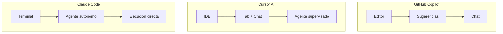
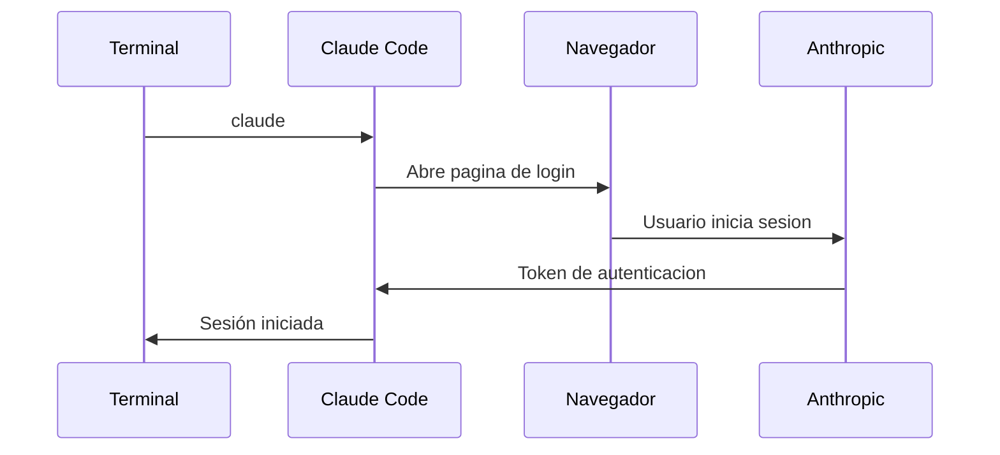

Autor: Alan Sastre

GitHub: [github.com/alansastre/genai-asistentes-codigo](https://github.com/alansastre/genai-asistentes-codigo)

**Claude Code** es una herramienta de desarrollo agentic creada por Anthropic que opera directamente desde la terminal. A diferencia de las extensiones para editores o los IDEs con IA integrada, Claude Code funciona como una interfaz de línea de comandos (CLI) que permite delegar tareas de programación mediante lenguaje natural, ejecutando cambios en el código de forma autónoma.

## Contexto y origen

Anthropic lanzó Claude Code públicamente en **febrero de 2025**, coincidiendo con la presentación de Claude 3.7 Sonnet y su modo de pensamiento extendido. Esta herramienta representa la evolución natural de los asistentes de IA hacia un modelo más autónomo, donde el desarrollador describe lo que necesita y el agente ejecuta las acciones necesarias en el sistema de archivos y la terminal.

El enfoque de Claude Code difiere fundamentalmente de herramientas anteriores. Mientras que GitHub Copilot y Cursor AI se centran en **sugerencias de código** dentro del editor, Claude Code actúa como un **agente autónomo** que puede navegar el sistema de archivos, ejecutar comandos, crear y modificar archivos, y gestionar flujos de trabajo de Git sin intervención manual constante.

> Claude Code requiere una suscripción a Claude Pro o Claude Max. Los usuarios Pro tienen acceso a los modelos Sonnet con uso limitado de Opus, mientras que Max ofrece límites extendidos y acceso completo a Opus 4.5.

## Comparativa con otras herramientas

Cada herramienta de desarrollo con IA tiene un enfoque distinto. Comprender estas diferencias ayuda a elegir la más adecuada según el contexto de trabajo.

| Característica | GitHub Copilot | Cursor AI | Claude Code |
|----------------|----------------|-----------|-------------|
| **Tipo** | Extensión para IDE | IDE completo | CLI en terminal |
| **Modo de operación** | Sugerencias inline | Chat + Sugerencias + Agente | Agente autónomo |
| **Contexto** | Archivo actual | Proyecto completo | Proyecto completo |
| **Ejecución de comandos** | No | Sí (con confirmación) | Sí (autónomo) |
| **Integración Git** | Limitada | Completa | Completa y autónoma |
| **Requiere editor** | Sí | Sí | No |

### GitHub Copilot

Funciona como una **extensión dentro de VS Code** u otros editores. Su fortaleza está en las sugerencias de código mientras se escribe. El modo Chat permite conversaciones contextuales, y el Coding Agent puede trabajar en issues de forma autónoma, pero siempre dentro del ecosistema de GitHub.

### Cursor AI

Es un **IDE completo** basado en VS Code que integra IA en todos sus componentes. Ofrece autocompletado con Tab, chat contextual y un modo agente que puede ejecutar cambios en múltiples archivos. Cursor mantiene al desarrollador en el centro, mostrando cada cambio antes de aplicarlo.

### Claude Code

Opera **exclusivamente desde la terminal**. No requiere un editor específico y puede trabajar en cualquier proyecto. Su naturaleza agentic significa que puede ejecutar secuencias completas de acciones: leer código, planificar cambios, modificar archivos, ejecutar tests y hacer commits. El desarrollador supervisa pero no interviene en cada paso.



> Claude Code resulta especialmente útil para tareas que involucran múltiples archivos, refactorizaciones extensas o automatización de flujos de trabajo. Para edición puntual de código, las herramientas basadas en editor pueden ser más directas.

## Instalación de Node.js con NVM

Claude Code requiere **Node.js versión 18 o superior**. La forma recomendada de instalar Node.js es mediante NVM (Node Version Manager), que permite gestionar múltiples versiones de Node en el mismo sistema y cambiar entre ellas fácilmente.

### Windows

En Windows, se utiliza **nvm-windows**, una implementación específica para este sistema operativo:

* **1.** Descarga el instalador desde el repositorio oficial: github.com/coreybutler/nvm-windows/releases
* **2.** Ejecuta el archivo `nvm-setup.exe`
* **3.** Sigue el asistente de instalación aceptando las opciones predeterminadas
* **4.** Cierra y vuelve a abrir PowerShell o Command Prompt

Verifica la instalación:

```powershell .noeval
nvm version
```

Instala Node.js (LTS recomendada):

```powershell .noeval
nvm install 24.12.0
nvm use 24.12.0
```

### macOS y Linux

En sistemas Unix, NVM se instala mediante un script:

```bash .noeval
curl -o- https://raw.githubusercontent.com/nvm-sh/nvm/v0.40.1/install.sh | bash
```

Tras la instalación, reinicia la terminal o ejecuta:

```bash .noeval
source ~/.bashrc
```

Instala Node.js:

```bash .noeval
nvm install 24.12.0
nvm use 24.12.0
```

Verifica que Node.js está correctamente instalado:

```bash .noeval
node --version
npm --version
```

> NVM permite tener múltiples versiones de Node.js instaladas. Puedes cambiar entre versiones con `nvm use <version>` según las necesidades de cada proyecto.

## Instalación de Claude Code

Con Node.js instalado, Claude Code se puede instalar de varias formas según el sistema operativo.

### Instalación con npm (multiplataforma)

El método más directo es mediante npm, disponible en todos los sistemas:

```bash .noeval
npm install -g @anthropic-ai/claude-code
```

Este comando instala Claude Code de forma global, haciéndolo accesible desde cualquier directorio.

### Instalación nativa en Windows

Windows dispone de un script de instalación específico:

```powershell .noeval
irm https://claude.ai/install.ps1 | iex
```

### Instalación nativa en macOS y Linux

En sistemas Unix:

```bash .noeval
curl -fsSL https://claude.ai/install.sh | bash
```

También está disponible mediante **Homebrew** en macOS:

```bash .noeval
brew install --cask claude-code
```

### Verificación de la instalación

Comprueba que Claude Code está instalado correctamente:

```bash .noeval
claude --version
```

## Primera ejecución

Para comenzar a usar Claude Code, navega al directorio de un proyecto y ejecuta el comando principal:

```bash .noeval
cd mi-proyecto
claude
```

La primera vez que ejecutes Claude Code, se abrirá el navegador para **autenticarte** con tu cuenta de Anthropic. Una vez autenticado, podrás interactuar con el agente desde la terminal.



Desde este momento, puedes escribir instrucciones en lenguaje natural. Claude Code analizará tu proyecto, planificará las acciones necesarias y las ejecutará, mostrando el progreso en tiempo real.

### Comandos básicos

| Comando | Descripción |
|---------|-------------|
| `claude` | Inicia sesión interactiva |
| `claude --help` | Muestra ayuda y opciones disponibles |
| `claude --continue` | Retoma la última conversación |
| `claude --resume` | Lista conversaciones anteriores para reanudar |
| `/help` | Muestra comandos disponibles dentro de la sesión |
| `/model` | Permite cambiar el modelo de IA |

> Claude Code mantiene el contexto de las conversaciones anteriores. Puedes retomar una sesión previa con `--continue` o seleccionar una específica con `--resume`.
