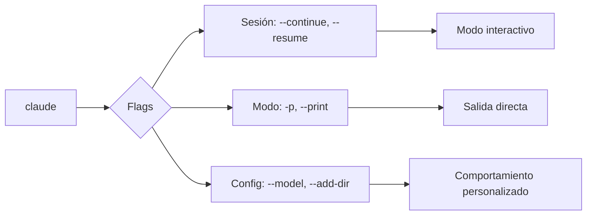

Autor: Alan Sastre

GitHub: [github.com/alansastre/genai-asistentes-codigo](https://github.com/alansastre/genai-asistentes-codigo)

Claude Code ofrece una **interfaz de línea de comandos** completa con múltiples flags, modos de operación y comandos internos. Esta lección detalla las opciones disponibles para controlar el comportamiento del agente, desde sesiones interactivas hasta ejecuciones automatizadas en scripts.

## Flags de línea de comandos

Al ejecutar `claude` desde la terminal, se pueden añadir **flags** que modifican su comportamiento. Estos flags permiten controlar aspectos como la continuación de sesiones, el modo de salida y la configuración del agente.

### Gestión de sesiones

Las sesiones en Claude Code mantienen el historial de la conversación y el contexto del proyecto. Varios flags facilitan la gestión de estas sesiones:

| Flag | Descripción |
|------|-------------|
| `--continue` | Retoma la última conversación desde donde se dejó |
| `--resume` | Muestra una lista de sesiones anteriores para seleccionar |
| `--resume <nombre>` | Retoma directamente una sesión con nombre específico |

```bash .noeval
# Continuar la última sesión
claude --continue

# Ver lista de sesiones anteriores
claude --resume

# Retomar una sesión específica por nombre
claude --resume "refactor-auth"
```

> Las sesiones pueden nombrarse con el comando `/rename` durante la conversación, facilitando su identificación posterior.

### Modo print

El flag `--print` o `-p` activa el **modo no interactivo**, donde Claude Code procesa una instrucción y muestra el resultado sin esperar más input. Este modo resulta útil para integrar Claude Code en scripts o pipelines de automatización.

```bash .noeval
# Ejecutar una tarea y obtener el resultado
claude -p "lista los archivos TypeScript en src/"

# Usar con redirección de salida
claude -p "genera un README para este proyecto" > README.md
```

El modo print admite opciones adicionales:

| Flag | Descripción |
|------|-------------|
| `--output-format stream-json` | Salida en formato JSON con streaming |
| `--system-prompt-file <archivo>` | Usa un archivo como system prompt personalizado |
| `--append-system-prompt <texto>` | Añade texto al system prompt predeterminado |

```bash .noeval
# Salida en formato JSON para procesamiento
claude -p "analiza la estructura del proyecto" --output-format stream-json
```

### Configuración del agente

Existen flags para personalizar el comportamiento del agente en cada ejecución:

| Flag | Descripción |
|------|-------------|
| `--model <modelo>` | Especifica el modelo de IA a utilizar |
| `--add-dir <directorio>` | Añade directorios adicionales al contexto |
| `--agent <agente>` | Usa un agente personalizado |
| `--debug` | Activa el modo depuración con información detallada |

```bash .noeval
# Usar un modelo específico
claude --model opus

# Añadir múltiples directorios al contexto
claude --add-dir ../shared-lib --add-dir ../common
```



## Modo interactivo

El modo interactivo es la forma principal de trabajar con Claude Code. Al ejecutar `claude` sin flags especiales, se inicia una **sesión conversacional** donde puedes enviar instrucciones y recibir respuestas en tiempo real.

### Atajos de teclado

Durante una sesión interactiva, varios atajos de teclado mejoran la productividad:

| Atajo | Función |
|-------|---------|
| `Tab` | Activa o desactiva el modo thinking |
| `Shift+Tab` | Activa auto-accept para ediciones de archivos |
| `Ctrl+R` | Busca en el historial de comandos |
| `Ctrl+G` | Abre el prompt en el editor de texto del sistema |
| `Ctrl+B` | Ejecuta un comando bash en segundo plano |
| `Enter` | Envía mensaje o encola mientras Claude trabaja |
| `Esc` | Cancela la operación actual |

> Puedes enviar mensajes adicionales mientras Claude está trabajando. Los mensajes se encolan y Claude los procesará en orden.

### Menciones con @

Las **menciones** permiten referenciar archivos directamente en el contexto de la conversación. Al escribir `@` seguido del nombre de un archivo, Claude Code lo incluye automáticamente en el contexto.

```bash .noeval
@src/auth/login.ts revisa este archivo y sugiere mejoras de seguridad
```

Las menciones soportan:

* **Archivos**: `@ruta/al/archivo.js`
* **Directorios**: `@src/components/`
* **Archivos ocultos**: `@.env.example`
* **Rutas con espacios**: `@"mi archivo.ts"`

Esta funcionalidad es similar a las menciones en Cursor AI, pero opera dentro del contexto de la terminal.

## Slash commands

Los **slash commands** son comandos internos que se ejecutan dentro de una sesión activa. Comienzan con `/` y permiten controlar configuraciones, gestionar plugins y navegar por el historial.

### Comandos de sesión

| Comando | Descripción |
|---------|-------------|
| `/help` | Muestra la lista de comandos disponibles |
| `/resume` | Lista sesiones anteriores para reanudar |
| `/rename <nombre>` | Asigna un nombre a la sesión actual |
| `/rewind` | Deshace cambios de código en la conversación |
| `/compact` | Compacta el contexto de la conversación |
| `/export` | Exporta la conversación para compartir |

```mermaid
%%{init: {'theme': 'default'}}%%
flowchart TB
    SESSION[Sesión activa]
    SESSION --> HELP[/help]
    SESSION --> RESUME[/resume]
    SESSION --> RENAME[/rename]
    SESSION --> REWIND[/rewind]
    SESSION --> COMPACT[/compact]
    
    REWIND --> UNDO[Deshace cambios]
    COMPACT --> OPTIMIZE[Optimiza contexto]
    RENAME --> NAME[Nombra sesión]
```

### Comandos de configuración

| Comando | Descripción |
|---------|-------------|
| `/config` | Abre la configuración de Claude Code |
| `/model` | Cambia el modelo de IA en uso |
| `/permissions` | Gestiona permisos de herramientas |
| `/add-dir <ruta>` | Añade directorios al contexto |
| `/vim` | Activa bindings de Vim para edición |

El comando `/model` permite cambiar entre los modelos disponibles durante la sesión:

```bash .noeval
/model opus
/model sonnet
```

### Comandos de información

| Comando | Descripción |
|---------|-------------|
| `/usage` | Muestra estadísticas de uso y límites del plan |
| `/stats` | Estadísticas detalladas: modelo favorito, gráfico de uso |
| `/todos` | Lista las tareas pendientes actuales |
| `/context` | Ayuda a depurar problemas de contexto |
| `/doctor` | Diagnóstico completo con mensajes de error detallados |
| `/release-notes` | Muestra las notas de la última versión |

> El comando `/doctor` es especialmente útil cuando algo no funciona como se espera. Valida la sintaxis de permisos y sugiere correcciones.

### Comandos de extensiones

| Comando | Descripción |
|---------|-------------|
| `/plugin` | Gestiona plugins: instalar, activar, desactivar |
| `/plugin marketplace` | Navega por el marketplace de plugins |
| `/mcp` | Gestiona servidores MCP |
| `/agents` | Crea y gestiona subagentes personalizados |

## Uso en scripts

Claude Code puede integrarse en **scripts de automatización** mediante el modo print y el piping de entrada. Esta capacidad permite crear flujos de trabajo automatizados.

### Ejemplo básico

```bash .noeval
#!/bin/bash
# Script que genera documentación automática

claude -p "genera documentación JSDoc para todos los archivos en src/utils/" > docs/utils.md
```

### Piping de contenido

Se puede enviar contenido directamente a Claude Code mediante pipes:

```bash .noeval
# Analizar el diff de Git
git diff HEAD~1 | claude -p "resume los cambios de este commit"

# Revisar logs de error
cat error.log | claude -p "analiza estos errores y sugiere soluciones"
```

### Combinación con otras herramientas

```bash .noeval
# Encontrar archivos y analizarlos
find . -name "*.test.js" -exec claude -p "revisa la cobertura de tests en {}" \;

# Procesar múltiples archivos
for file in src/*.ts; do
    claude -p "añade tipos TypeScript estrictos a $file"
done
```

> El modo print con piping permite integrar Claude Code en cualquier pipeline de CI/CD o script de mantenimiento del proyecto.
