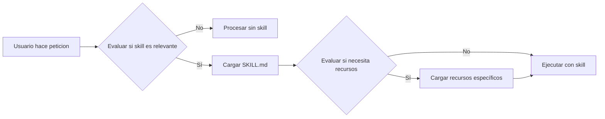
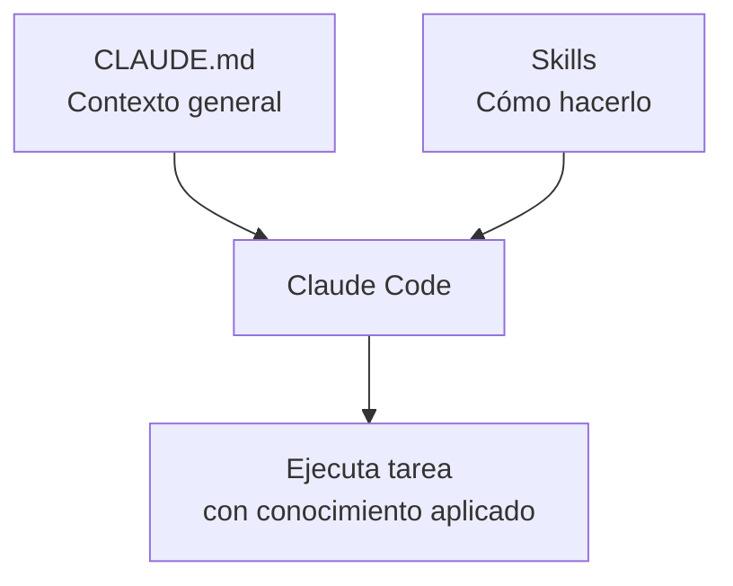

Autor: Alan Sastre

GitHub: [github.com/alansastre/genai-asistentes-codigo](https://github.com/alansastre/genai-asistentes-codigo)

Claude Code utiliza un sistema de **memoria y skills** para mantener contexto sobre el proyecto y aplicar conocimiento especializado. El archivo `CLAUDE.md` almacena las convenciones del proyecto, mientras que los **Agent Skills** son paquetes de conocimiento reutilizable que Claude activa automáticamente según el contexto de cada tarea.

## Origen e historia de Agent Skills

Los **Agent Skills** fueron introducidos por Anthropic el **16 de octubre de 2025** como una forma de transformar agentes de propósito general en agentes especializados que se adaptan a necesidades específicas. Posteriormente, el **18 de diciembre de 2025**, Anthropic publicó Agent Skills como un **estándar abierto** en [agentskills.io](https://agentskills.io), permitiendo que cualquier plataforma de IA adopte el formato.

Esta decisión de abrir el estándar sigue el mismo patrón que Anthropic utilizó con el **Model Context Protocol (MCP)** en 2024, donado posteriormente a la Linux Foundation. Mientras MCP define *cómo los agentes se conectan a fuentes de datos*, Agent Skills define *cómo los agentes ejecutan tareas*. Juntos, representan el "dual-stack" de la era moderna de agentes de IA.

### Adopción por otros proveedores

La especificación abierta ya está siendo adoptada por competidores y partners:

* **OpenAI** ha adoptado una arquitectura estructuralmente idéntica en ChatGPT y su herramienta Codex CLI
* **Microsoft**, **Cursor** y **GitHub** también han implementado el estándar
* Partners como **Atlassian**, **Figma**, **Canva**, **Stripe**, **Notion** y **Zapier** han contribuido skills oficiales

> Esto significa que los skills que crees no están bloqueados a Claude: el mismo formato funciona en cualquier plataforma que adopte el estándar.

## CLAUDE.md: memoria del proyecto

El archivo `CLAUDE.md` ubicado en la raíz del proyecto actúa como la **memoria principal** de Claude Code. Contiene las convenciones, reglas y contexto específico que los agentes utilizan para tomar decisiones coherentes con el proyecto.

```bash .noeval
mi-proyecto/
├── CLAUDE.md           # Memoria principal
├── .claude/
│   └── settings.json
├── src/
└── tests/
```

Claude Code lee automáticamente este archivo al iniciar una sesión y lo usa para:

* Verificar que los cambios cumplan con las convenciones del proyecto
* Entender la arquitectura y patrones establecidos
* Mantener consistencia en estilo de código y nomenclatura
* Recordar decisiones técnicas importantes

### Contenido recomendado

Un archivo `CLAUDE.md` efectivo incluye información sobre el stack, convenciones y patrones del proyecto:

```markdown .noeval
# Proyecto API de Inventario

## Stack tecnológico
- Backend: FastAPI con Python 3.12
- Base de datos: PostgreSQL con SQLAlchemy
- Tests: pytest con fixtures compartidos

## Convenciones de código
- Imports ordenados: stdlib, terceros, locales
- Type hints obligatorios en funciones públicas
- Nombres de variables en snake_case

## Patrones prohibidos
- No usar queries directamente en routes
- No commits sin tests asociados
```

> El contenido de `CLAUDE.md` influye directamente en cómo Claude Code revisa y genera código. Un archivo bien estructurado reduce errores y mantiene la consistencia.

## Qué son los Agent Skills

Los **Agent Skills** son directorios organizados que contienen instrucciones, scripts y recursos que los agentes pueden descubrir y cargar dinámicamente. Representan guías de estilo, convenciones o patrones que Claude aplica automáticamente cuando detecta que son relevantes para la tarea actual.

La diferencia clave con CLAUDE.md es:

* **CLAUDE.md**: describe el proyecto y sus reglas generales (siempre activo)
* **Skills**: proporcionan instrucciones especializadas para tipos específicos de tareas (se activan bajo demanda)

### Ventajas frente a usar prompts simples

Los Agent Skills resuelven limitaciones importantes de los prompts tradicionales:

| Aspecto | Prompts simples | Agent Skills |
|---------|-----------------|--------------|
| **Carga de contexto** | Todo de una vez, consume tokens | Bajo demanda, solo lo necesario |
| **Reutilización** | Copiar/pegar manual | Automática por detección de contexto |
| **Escalabilidad** | Limitada por tamaño de contexto | Sin límite práctico gracias a progressive disclosure |
| **Mantenimiento** | Disperso en múltiples lugares | Centralizado y versionado |
| **Portabilidad** | Específico de cada herramienta | Estándar abierto, funciona en múltiples plataformas |
| **Composición** | Manual y propenso a errores | Múltiples skills trabajan juntos automáticamente |

### Progressive Disclosure: el principio de diseño

El concepto central de Agent Skills es la **revelación progresiva** (progressive disclosure). En lugar de cargar toda la información de una vez, los skills organizan el conocimiento en niveles:

1. **Nivel 1 - Metadatos**: Solo el nombre y descripción se cargan inicialmente en el prompt del sistema
2. **Nivel 2 - Contenido del skill**: El archivo `SKILL.md` completo se carga cuando Claude determina que es relevante
3. **Nivel 3+ - Recursos adicionales**: Archivos vinculados se acceden solo cuando son necesarios



> Este diseño permite que los agentes trabajen con grandes cantidades de conocimiento especializado sin estar limitados por el tamaño del contexto.

### Cuándo usar cada extensión

| Tipo | Qué define | Activación | Ejemplo |
|------|------------|------------|---------|
| **CLAUDE.md** | Contexto general del proyecto | Siempre activo | Stack tecnológico, convenciones |
| **Skills** | Cómo hacer algo específico | Automática por contexto | Guía de diseño, estilo de documentación |
| **Agentes** | Quién hace la tarea | Explícita con `@agente` | Revisor de código, generador de tests |
| **Comandos** | Qué acción ejecutar | Explícita con `/comando` | Crear endpoint, ejecutar checks |



> Los skills complementan al archivo CLAUDE.md proporcionando conocimiento procedimental detallado para tareas específicas.

## Estructura de un skill

Los skills se organizan en directorios dentro de `.claude/skills/` (proyecto) o `~/.claude/skills/` (personal). Cada skill tiene su propia carpeta con un archivo principal `SKILL.md`:

```bash .noeval
.claude/
├── skills/
│   ├── mi-skill/
│   │   ├── SKILL.md          # Archivo principal (obligatorio)
│   │   ├── reference.md      # Documentación adicional (opcional)
│   │   ├── examples/         # Ejemplos de uso (opcional)
│   │   └── scripts/          # Código ejecutable (opcional)
│   └── otro-skill/
│       └── SKILL.md
└── settings.json
```

### Archivo SKILL.md

Cada skill se define con metadatos YAML en el frontmatter (obligatorios: `name` y `description`) y las instrucciones en Markdown:

```markdown .noeval
---
name: nombre-del-skill
description: Cuándo debe activarse este skill (esto es lo que Claude lee primero)
version: 1.0.0
---

# Título del skill

## Instrucciones
Aquí van las instrucciones detalladas que Claude debe seguir
cuando este skill está activo.

## Recursos adicionales
- Ver [reference.md](./reference.md) para documentación completa
- Ejecutar [validate.py](./scripts/validate.py) para validación
```

### Skills con código ejecutable

Los skills pueden incluir scripts que Claude ejecuta como herramientas. Esto permite automatizar tareas complejas:

```bash .noeval
.claude/skills/
└── data-validation/
    ├── SKILL.md
    └── scripts/
        ├── validate_schema.py
        └── generate_report.py
```

```markdown .noeval
---
name: data-validation
description: Valida y genera reportes de datos CSV/JSON
version: 1.0.0
---

# Validación de datos

Cuando el usuario pida validar datos, ejecuta el script correspondiente:

- Para validar esquema: `python scripts/validate_schema.py <archivo>`
- Para generar reporte: `python scripts/generate_report.py <archivo>`
```

## Ejemplos prácticos

### Skill de guías de marca

Un skill muy útil es definir las guías de marca de la empresa para que Claude las aplique automáticamente:

```markdown .noeval
---
name: brand-guidelines
description: Aplica las guías de marca de la empresa en documentación y presentaciones
version: 1.0.0
---

# Guías de marca

## Colores oficiales
- Primario: #FF6B35 (Coral)
- Secundario: #004E89 (Azul marino)
- Acento: #F7B801 (Dorado)

## Tipografía
- Títulos: Montserrat Bold
- Cuerpo: Open Sans Regular

## Cuándo aplicar
Aplicar estas guías cuando se creen:
- Documentación para clientes
- Presentaciones
- Materiales de marketing
```

Con este skill, cuando pidas a Claude que genere documentación, automáticamente aplicará estos colores y tipografías.

### Skill de estilo de API

Para un proyecto FastAPI, un skill puede definir el estilo de diseño de endpoints:

```markdown .noeval
---
name: api-style
description: Estilo de diseño para endpoints de la API REST
version: 1.0.0
---

# Estilo de API

## Nomenclatura de rutas
- Usar plurales: /users, /products
- Recursos anidados: /users/{id}/orders
- Acciones como verbos: /orders/{id}/cancel

## Respuestas
- Éxito: 200 para GET, 201 para POST, 204 para DELETE
- Errores: usar HTTPException con mensajes descriptivos
- Paginación: incluir total, page y per_page

## Validación
- Usar modelos Pydantic para request y response
- Validar en el modelo, no en el endpoint
```

Cuando trabajes en endpoints, Claude aplicará automáticamente este estilo sin necesidad de recordárselo.

### Skill de documentación

Define cómo debe Claude generar documentación:

```markdown .noeval 
---
name: docs-style
description: Estilo para documentación técnica del proyecto
version: 1.0.0
---

# Estilo de documentación

## Formato de docstrings
Usar formato Google para todas las funciones públicas.

## README de módulos
Cada módulo debe tener un README.md con:
- Descripción breve
- Ejemplos de uso
- Dependencias

## Idioma
- Código y comentarios en inglés
- Documentación de usuario en español
```

## Cuándo crear un skill

Los skills son útiles cuando tienes **conocimiento recurrente** que quieres que Claude aplique de forma consistente:

* **Guías de estilo visual**: colores, tipografías, layouts
* **Convenciones de API**: nomenclatura, respuestas, errores
* **Patrones de código**: estructuras preferidas, anti-patrones a evitar
* **Estilo de documentación**: formato, idioma, estructura
* **Flujos de trabajo**: pasos para tareas comunes

> Los skills permiten codificar el conocimiento del equipo, asegurando que Claude genere resultados consistentes sin explicar las convenciones cada vez.

## Diferencia con CLAUDE.md

| CLAUDE.md | Skills |
|-----------|--------|
| Un solo archivo por proyecto | Múltiples skills organizados por tema |
| Contexto general siempre activo | Se activan según el contexto de la tarea |
| Describe qué es el proyecto | Describe cómo hacer tareas específicas |
| Reglas y restricciones | Guías y patrones a seguir |

Ambos se complementan: `CLAUDE.md` establece las reglas generales del proyecto, mientras que los skills proporcionan el conocimiento detallado para tipos específicos de tareas.

## Ecosistema y marketplace de skills

### Repositorio oficial de Anthropic

Anthropic mantiene un repositorio público de skills en [github.com/anthropics/skills](https://github.com/anthropics/skills). Puedes instalar skills desde este repositorio usando Claude Code:

```bash .noeval
# Registrar el marketplace de Anthropic
/plugin marketplace add anthropic-agent-skills https://github.com/anthropics/skills

# Instalar un skill específico
/plugin install document-skills@anthropic-agent-skills
```

### Skills de partners oficiales

Empresas como Atlassian, Figma, Canva, Stripe, Notion y Zapier han contribuido skills oficiales que aprovechan sus plataformas:

| Partner | Tipo de skill | Funcionalidad |
|---------|---------------|---------------|
| **Box** | Documentos | Transforma archivos en PowerPoint, Excel y Word siguiendo estándares organizacionales |
| **Canva** | Diseño | Personaliza agentes para flujos de trabajo de diseño |
| **Notion** | Productividad | Integración con espacios de trabajo de Notion |
| **Rakuten** | Finanzas | Flujos de contabilidad y gestión financiera |

### Casos de uso empresariales

Los skills son útiles para **capturar y compartir conocimiento procedimental** dentro de organizaciones:

* **Onboarding**: Skills que guían a nuevos desarrolladores con las convenciones del equipo
* **Compliance**: Skills que aseguran cumplimiento de regulaciones (GDPR, HIPAA, etc.)
* **Brand consistency**: Skills que mantienen coherencia visual en todos los materiales
* **Automatización**: Skills con scripts que automatizan flujos de trabajo repetitivos

> En planes Team y Enterprise, los administradores pueden aprovisionar skills centralmente, controlando qué flujos de trabajo están disponibles en toda la organización.

## Recursos y referencias

* **Especificación oficial**: [agentskills.io](https://agentskills.io)
* **Repositorio de skills**: [github.com/anthropics/skills](https://github.com/anthropics/skills)
* **Documentación**: [platform.claude.com/docs/en/agents-and-tools/agent-skills](https://platform.claude.com/docs/en/agents-and-tools/agent-skills/overview)
* **Blog de ingeniería**: [anthropic.com/engineering/equipping-agents-for-the-real-world-with-agent-skills](https://www.anthropic.com/engineering/equipping-agents-for-the-real-world-with-agent-skills)
