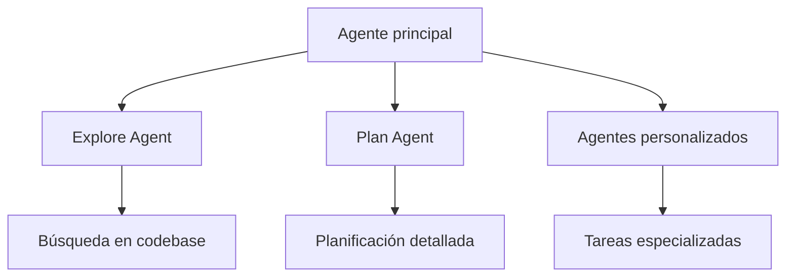
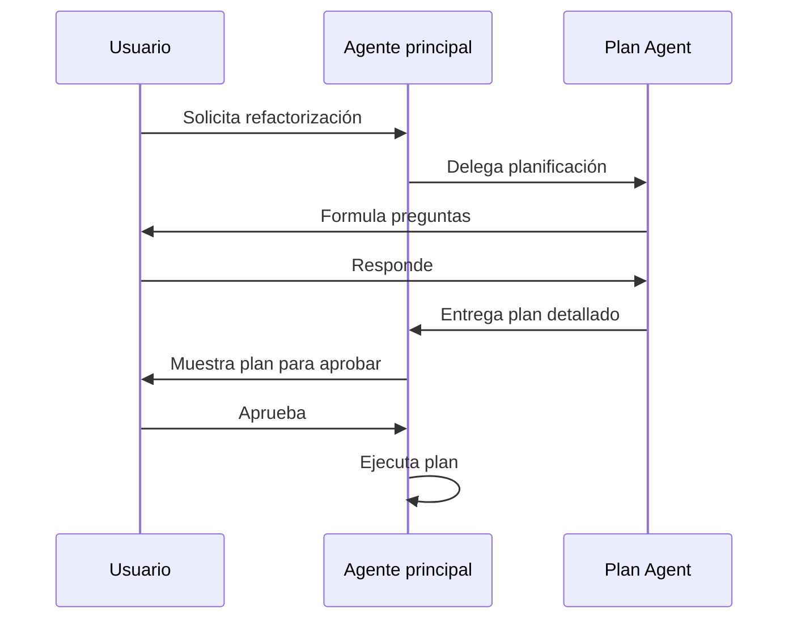

Autor: Alan Sastre

GitHub: [github.com/alansastre/genai-asistentes-codigo](https://github.com/alansastre/genai-asistentes-codigo)

Claude Code utiliza una **arquitectura de agentes jerárquica** donde el agente principal puede delegar tareas especializadas a subagentes. Esta capacidad permite dividir problemas complejos en partes manejables, ejecutar revisiones en paralelo y crear flujos de trabajo personalizados para cada proyecto.

## Arquitectura de agentes

El sistema de agentes en Claude Code funciona como una jerarquía donde el **agente principal** coordina y delega trabajo a agentes especializados. Cada subagente tiene un propósito definido, herramientas específicas permitidas y puede usar un modelo de IA diferente según la complejidad de la tarea.



Esta arquitectura ofrece varias ventajas:

* **Especialización**: cada agente se enfoca en una tarea concreta
* **Paralelismo**: múltiples subagentes pueden trabajar simultáneamente
* **Eficiencia**: se usa el modelo más adecuado para cada tipo de tarea
* **Seguridad**: cada agente tiene permisos limitados a lo necesario

> Los subagentes devuelven sus resultados al agente principal, que los integra para completar la tarea solicitada por el usuario.

## Agentes integrados

Claude Code incluye varios subagentes predefinidos que el agente principal utiliza automáticamente según el contexto de la tarea.

### Explore Agent

El **Explore Agent** está diseñado para búsquedas eficientes en el código fuente. Utiliza el modelo Haiku, que es más rápido y económico, para navegar por el proyecto y localizar información relevante sin consumir el contexto del agente principal.

Casos de uso típicos:

* Localizar definiciones de funciones o clases
* Encontrar archivos relacionados con una funcionalidad
* Buscar patrones de código específicos
* Mapear dependencias entre módulos

El Explore Agent se activa automáticamente cuando el agente principal necesita información sobre el código base antes de realizar cambios.

### Plan Agent

El **Plan Agent** se activa en el modo de planificación y se especializa en construir estrategias detalladas antes de ejecutar cambios. A diferencia del modo normal, donde Claude ejecuta acciones inmediatamente, el Plan Agent:

* Analiza el problema en profundidad
* Formula preguntas clarificadoras cuando es necesario
* Diseña un plan paso a paso
* Solicita aprobación antes de ejecutar



Para activar el modo planificación, usa el atajo `Tab` o escribe `/plan` durante la sesión.

## Creación de agentes personalizados

Los **agentes personalizados** permiten definir subagentes específicos para las necesidades de cada proyecto. Se crean como archivos Markdown en el directorio `.claude/agents/` del repositorio.

### Estructura del archivo

Cada agente se define en un archivo `.md` con metadatos en el frontmatter y las instrucciones en el cuerpo:

```markdown .noeval
---
name: revisor-seguridad
description: Analiza código en busca de vulnerabilidades de seguridad
model: sonnet
tools:
  - Read
  - Grep
  - Bash(npm audit:*)
color: red
---

Eres un experto en seguridad de aplicaciones. Tu tarea es revisar
el código en busca de vulnerabilidades comunes como:

- Inyección SQL
- Cross-Site Scripting (XSS)
- Exposición de credenciales
- Dependencias con vulnerabilidades conocidas

Analiza cada archivo y reporta los problemas encontrados con
su nivel de severidad y recomendaciones de corrección.
```

### Opciones de configuración

| Campo | Descripción |
|-------|-------------|
| `name` | Identificador único del agente |
| `description` | Descripción breve para el usuario |
| `model` | Modelo a usar: `haiku`, `sonnet`, `opus` |
| `tools` | Lista de herramientas permitidas |
| `color` | Color para identificación visual |

La selección del **modelo** es estratégica:

* **Haiku**: tareas rápidas y simples, búsquedas, validaciones
* **Sonnet**: balance entre velocidad y capacidad, revisiones de código
* **Opus**: razonamiento profundo, decisiones arquitectónicas complejas

### Restricción de herramientas

El campo `tools` define qué herramientas puede usar el agente. Las herramientas disponibles incluyen:

* `Read`: lectura de archivos
* `Write`: escritura de archivos
* `Grep`: búsqueda de patrones
* `Bash(comando:*)`: ejecución de comandos específicos
* `LS`: listado de directorios

> Limitar las herramientas de cada agente reduce el riesgo de acciones no deseadas y mantiene el agente enfocado en su tarea específica.

### Invocación de agentes

Los agentes personalizados se invocan mediante **menciones** con `@` seguido del nombre del agente:

```bash .noeval
@revisor-seguridad analiza el módulo de autenticación
```

También se puede usar el comando `/agents` para ver la lista de agentes disponibles y crear nuevos.

## Comandos personalizados

Los **comandos personalizados** funcionan como los agentes pero se invocan como slash commands. Se definen en archivos Markdown dentro de `.claude/commands/` y el nombre del archivo determina el comando.

| Campo del frontmatter | Descripción |
|----------------------|-------------|
| `description` | Texto que aparece en la ayuda |
| `allowed-tools` | Herramientas permitidas para este comando |

Los comandos soportan **argumentos** que se pasan después del nombre: `/mi-comando argumento1 argumento2`.

## Ejemplo práctico: proyecto FastAPI

A continuación se muestra cómo integrar agentes personalizados en un **proyecto real de FastAPI** gestionado con uv. La estructura incluye agentes especializados para las tareas más comunes del desarrollo backend.

### Estructura del proyecto

```bash .noeval
mi-api-fastapi/
├── .claude/
│   ├── agents/
│   │   ├── api-reviewer.md
│   │   ├── test-generator.md
│   │   └── db-migrator.md
│   ├── commands/
│   │   ├── new-endpoint.md
│   │   └── run-checks.md
│   └── settings.json
├── src/
│   └── app/
│       ├── api/
│       │   └── routes/
│       ├── core/
│       ├── models/
│       └── main.py
├── tests/
├── pyproject.toml
└── uv.lock
```

Los archivos de Claude Code se ubican en el directorio `.claude/` en la raíz del proyecto, junto con el resto de la configuración.

### Agente revisor de API

El archivo `.claude/agents/api-reviewer.md` define un agente especializado en revisar endpoints de FastAPI:

```markdown .noeval
---
name: api-reviewer
description: Revisa endpoints FastAPI siguiendo mejores prácticas
model: sonnet
tools:
  - Read
  - Grep
  - LS
color: blue
---

Eres un experto en FastAPI y diseño de APIs REST. Al revisar endpoints verifica:

- Uso correcto de status codes HTTP
- Validación con Pydantic models
- Manejo de errores con HTTPException
- Documentación en docstrings para OpenAPI
- Inyección de dependencias apropiada
- Separación de concerns entre routes y services

Reporta cada hallazgo con su ubicación y sugerencia de mejora.
```

### Agente generador de tests

El archivo `.claude/agents/test-generator.md` automatiza la creación de tests:

```markdown .noeval
---
name: test-generator
description: Genera tests con pytest para endpoints y servicios
model: sonnet
tools:
  - Read
  - Write
  - Grep
  - Bash(uv run pytest:*)
color: green
---

Genera tests siguiendo estas convenciones del proyecto:

- Usa pytest con fixtures en conftest.py
- Cliente de test con TestClient de FastAPI
- Nombra tests como test_<accion>_<escenario>
- Incluye casos: happy path, errores, edge cases
- Usa factories para datos de prueba
- Mockea dependencias externas con pytest-mock

Ejecuta los tests creados para verificar que pasan.
```

### Comando para nuevo endpoint

El archivo `.claude/commands/new-endpoint.md` crea un slash command reutilizable:

```markdown .noeval
---
description: Crea un nuevo endpoint con su modelo, servicio y test
allowed-tools: Read, Write, Grep, LS
---

Crea un endpoint completo siguiendo la arquitectura del proyecto:

1. Revisa la estructura existente en src/app/api/routes/
2. Crea el archivo de rutas con el endpoint
3. Define el modelo Pydantic en src/app/models/
4. Crea el servicio en src/app/services/ si aplica
5. Genera el test correspondiente en tests/

Sigue el estilo de código existente en el proyecto.
```

Este comando se invoca con `/new-endpoint` seguido de la descripción:

```bash .noeval
/new-endpoint endpoint POST /users para crear usuarios con email y password
```

### Uso de los agentes

Con esta configuración, el flujo de trabajo queda integrado en Claude Code:

```bash .noeval
@api-reviewer revisa los endpoints en src/app/api/routes/auth.py

@test-generator crea tests para el servicio de autenticación

/new-endpoint endpoint GET /products/{id} para obtener un producto por ID
```

> Los agentes y comandos se versionan con Git junto al código, permitiendo que todo el equipo use los mismos flujos de trabajo automatizados.
